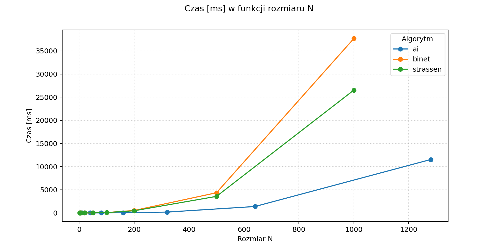
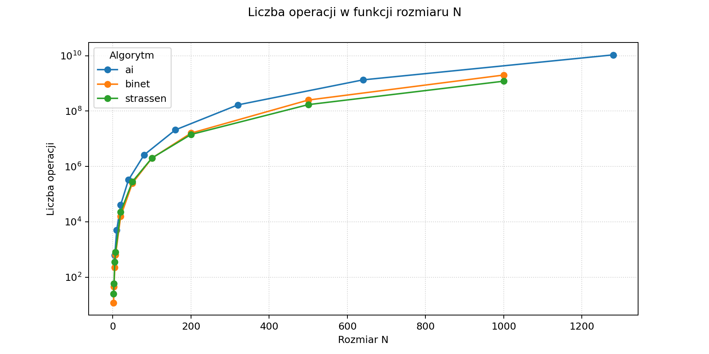
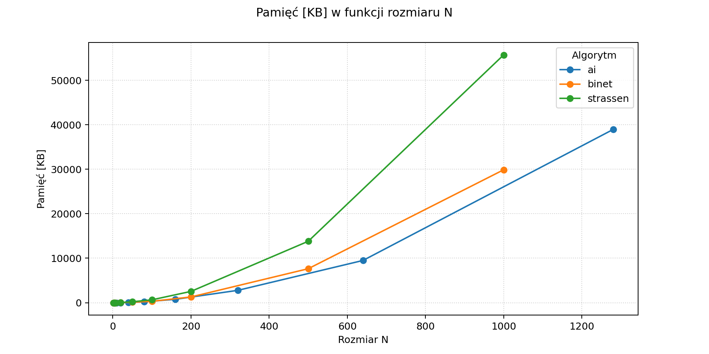

# Sprawozdanie — Lab 1: Rekurencyjne mnożenie macierzy (Binét, Strassen, AI)

Autorzy: Marek Swakoń, Szymon Tyburczy

## Cel i zakres

W ramach pierwszego zestawu zadań zaimplementowano i przeanalizowano trzy algorytmy mnożenia macierzy z losowymi wartościami z przedziału otwartego (0.00000001, 1.0):

- Rekurencyjne mnożenie macierzy metodą Binét’a
- Rekurencyjne mnożenie macierzy metodą Strassena
- Mnożenie macierzy metodą AI (na podstawie artykułu w Nature)

W trakcie eksperymentów zliczano liczbę operacji zmiennoprzecinkowych (dodawanie, odejmowanie, mnożenie, dzielenie) wykonywanych podczas mnożenia.

## Generowanie danych wejściowych

- Generator macierzy: wartości losowe z przedziału (0.00000001, 1.0), rozkład jednostajny.
- Rozmiary testowe: 1, 2, 3, …, 1000 (do maksymalnego N, który dało się policzyć na stanowisku).
- Warunki brzegowe: małe N (walidacja poprawności), duże N (pomiar wydajności i zużycia pamięci).

## Pseudokod (wysoki poziom)

### 1) Binét — rekurencyjne mnożenie

1. Wejście: Macierze A ∈ R^{m×k}, B ∈ R^{k×p}
2. Jeśli m ≤ 2 lub k ≤ 2 lub p ≤ 2: wykonaj naiwne (iteracyjne) mnożenie i zliczając operacje
3. Podziel A na 4 podmacierze: a11, a12, a21, a22
4. Podziel B na 4 podmacierze: b11, b12, b21, b22
5. Oblicz rekurencyjnie 8 iloczynów częściowych:
   - M1 = a11 \* b11
   - M2 = a12 \* b21
   - M3 = a11 \* b12
   - M4 = a12 \* b22
   - M5 = a21 \* b11
   - M6 = a22 \* b21
   - M7 = a21 \* b12
   - M8 = a22 \* b22
6. Złóż macierz C z sum częściowych:
   - c11 = M1 + M2
   - c12 = M3 + M4
   - c21 = M5 + M6
   - c22 = M7 + M8
7. Zwróć C

### 2) Strassen — rekurencyjne mnożenie

1. Wejście: A, B ∈ R^{N×N}
2. Dla N = 1: zwróć [A[0,0]·B[0,0]]
3. Dla N parzystego:
   - Podziel A i B na 4 podmacierze każda
   - Wyznacz pomocnicze sumy i różnice potrzebne do obliczenia M1…M7
   - Wyznacz 7 iloczynów pośrednich (M1…M7) zgodnie z klasycznym schematem Strassena
   - Złóż C z kombinacji M1…M7
4. Dla N nieparzystego:
   - Podziel A i B na 4 niesymetryczne bloki: główny (N-1)×(N-1), kolumnę (N-1)×1, wiersz 1×(N-1) i skalar 1×1
   - Wyznacz 4 bloki wynikowe (C11, C12, C21, C22) zgodnie ze standardową formułą mnożenia blokowego
   - Wyznacz iloczyn główny (A11B11) przez rekurencyjne wywołanie Strassena; pozostałe 7 iloczynów oblicz metodą iteracyjną
   - Złóż C z obliczonych bloków C11, C12, C21, C22
5. Zwróć C

### 3) Metoda AI (wg Nature)

##### Funkcja bazowa:

1. Wejście: macierz A [4×5], macierz B [5×5]:
2. Oblicz 76 wartości H, zgodnie z opisem metody z artykułu
3. Utwórz macierz C [4×5]
4. Wypełnij C kombinacjami wartości H, zgodnie z opisem metody z artykułu
5. Zwróć C

---

##### Funkcja rekurencyjna:

1. Sprawdź warunek bazowy: JEŻELI (M=4, K=5, P=5), ZWRÓĆ matrix_ai(A, B)
2. Sprawdź parzystość: JEŻELI (M, K lub P jest nieparzyste), ZGŁOŚ BŁĄD
3. Podziel A na 4 bloki: A11, A12, A21, A22
4. Podziel B na 4 bloki: B11, B12, B21, B22
5. Oblicz 8 iloczynów pośrednich przez rekurencyjne wywołania
6. Oblicz 4 bloki wynikowe przez sumowanie par (np. C11 = P1 + P2, C12 = P3 + P4, ...)
7. Złóż C [M×P] z bloków C11, C12, C21, C22
8. Zwróć C

## Najważniejsze fragmenty kodu

- Implementacja rekurencyjna Binét
- Implementacja Strassena (z obsługą brzegów lub informacją o ograniczeniach)
- Implementacja AI (oraz licznik operacji)

### Funkcje pomocnicze

- Funkcja generująca macierz o zadanych wymiarach z wartościami między 0.00000001 a 1.0

```cpp
Matrix createMatrix(size_t rows, size_t cols, bool random)
{
    Matrix mat(rows, std::vector<double>(cols, 0.0));
    if (random && rows > 0 && cols > 0)
    {
        unsigned seed = std::chrono::system_clock::now().time_since_epoch().count();
        std::mt19937 gen(seed);
        std::uniform_real_distribution<double> dis(0.00000001, 1.0);

        for (size_t i = 0; i < rows; ++i)
        {
            for (size_t j = 0; j < cols; ++j)
            {
                mat[i][j] = dis(gen);
            }
        }
    }
    return mat;
}
```

- Funkcje dodająca dwie macierze i zliczająca operacje

```cpp
Matrix addMatrices(const Matrix &A, int rA, int cA,
                   const Matrix &B, int rB, int cB,
                   int rows, int cols, unsigned long long &op_count)
{
    Matrix C = createMatrix(rows, cols);
    for (int i = 0; i < rows; i++)
    {
        for (int j = 0; j < cols; j++)
        {
            C[i][j] = A[rA + i][cA + j] + B[rB + i][cB + j];
            op_count++;
        }
    }
    return C;
}

void addMatrices_inplace(Matrix &C, int rC, int cC,
                         const Matrix &A, int rA, int cA,
                         const Matrix &B, int rB, int cB,
                         int rows, int cols, unsigned long long &op_count)
{
    for (int i = 0; i < rows; i++)
    {
        for (int j = 0; j < cols; j++)
        {
            C[rC + i][cC + j] = A[rA + i][cA + j] + B[rB + i][cB + j];
            op_count++;
        }
    }
}
```

- Funkcje odejmująca dwie macierze i zliczająca operacje

```cpp
Matrix subtractMatrices(const Matrix &A, int rA, int cA,
                        const Matrix &B, int rB, int cB,
                        int rows, int cols, unsigned long long &op_count)
{
    Matrix C = createMatrix(rows, cols);
    for (int i = 0; i < rows; i++)
    {
        for (int j = 0; j < cols; j++)
        {
            C[i][j] = A[rA + i][cA + j] - B[rB + i][cB + j];
            op_count++;
        }
    }
    return C;
}

void subtractMatrices_inplace(Matrix &C, int rC, int cC,
                              const Matrix &A, int rA, int cA,
                              const Matrix &B, int rB, int cB,
                              int rows, int cols, unsigned long long &op_count)
{
    for (int i = 0; i < rows; i++)
    {
        for (int j = 0; j < cols; j++)
        {
            C[rC + i][cC + j] = A[rA + i][cA + j] - B[rB + i][cB + j];
            op_count++;
        }
    }
}
```

- Funkcja mnożenia iteracyjnego z licznikiem operacji

```cpp
void iterativeMultiply_inplace(Matrix &C, int rC, int cC,
                               const Matrix &A, int rA, int cA,
                               const Matrix &B, int rB, int cB,
                               int m, int k, int p, unsigned long long &op_count)
{
    for (int i = 0; i < m; ++i)
    {
        for (int j = 0; j < p; ++j)
        {
            double sum = 0.0;
            for (int l = 0; l < k; ++l)
            {
                sum += A[rA + i][cA + l] * B[rB + l][cB + j];
                op_count++;
            }
            C[rC + i][cC + j] = sum;
            if (k > 1)
            {
                op_count += (k - 1);
            }
        }
    }
}
```

- Funkcja zwracająca maksymalne zużycie pamięci w KB podczas działania programu

```cpp
double getPeakPrivateUsageKB()
{
    PROCESS_MEMORY_COUNTERS pmc;
    if (GetProcessMemoryInfo(GetCurrentProcess(), &pmc, sizeof(pmc)))
    {
        return pmc.PeakPagefileUsage / 1024.0;
    }
    return 0;
}
```

### Implementacja rekurencyjna Binét

```cpp
void recursiveMultiply(Matrix &C, int rC, int cC,
                       const Matrix &A, int rA, int cA,
                       const Matrix &B, int rB, int cB,
                       int m, int k, int p, unsigned long long &op_count)
{
    if (m <= 2 || k <= 2 || p <= 2)
    {
        iterativeMultiply_inplace(C, rC, cC, A, rA, cA, B, rB, cB, m, k, p, op_count);
        return;
    }

    int m_split = m / 2;
    int k_split = k / 2;
    int p_split = p / 2;

    int m_rem = m - m_split;
    int k_rem = k - k_split;
    int p_rem = p - p_split;

    Matrix c11_p1 = createMatrix(m_split, p_split, false);
    Matrix c11_p2 = createMatrix(m_split, p_split, false);
    Matrix c12_p1 = createMatrix(m_split, p_rem, false);
    Matrix c12_p2 = createMatrix(m_split, p_rem, false);
    Matrix c21_p1 = createMatrix(m_rem, p_split, false);
    Matrix c21_p2 = createMatrix(m_rem, p_split, false);
    Matrix c22_p1 = createMatrix(m_rem, p_rem, false);
    Matrix c22_p2 = createMatrix(m_rem, p_rem, false);

    // 1. C11_p1 = A11 * B11
    recursiveMultiply(c11_p1, 0, 0, A, rA, cA, B, rB, cB, m_split, k_split, p_split, op_count);
    // 2. C11_p2 = A12 * B21
    recursiveMultiply(c11_p2, 0, 0, A, rA, cA + k_split, B, rB + k_split, cB, m_split, k_rem, p_split, op_count);

    // 3. C12_p1 = A11 * B12
    recursiveMultiply(c12_p1, 0, 0, A, rA, cA, B, rB, cB + p_split, m_split, k_split, p_rem, op_count);
    // 4. C12_p2 = A12 * B22
    recursiveMultiply(c12_p2, 0, 0, A, rA, cA + k_split, B, rB + k_split, cB + p_split, m_split, k_rem, p_rem, op_count);

    // 5. C21_p1 = A21 * B11
    recursiveMultiply(c21_p1, 0, 0, A, rA + m_split, cA, B, rB, cB, m_rem, k_split, p_split, op_count);
    // 6. C21_p2 = A22 * B21
    recursiveMultiply(c21_p2, 0, 0, A, rA + m_split, cA + k_split, B, rB + k_split, cB, m_rem, k_rem, p_split, op_count);

    // 7. C22_p1 = A21 * B12
    recursiveMultiply(c22_p1, 0, 0, A, rA + m_split, cA, B, rB, cB + p_split, m_rem, k_split, p_rem, op_count);
    // 8. C22_p2 = A22 * B22
    recursiveMultiply(c22_p2, 0, 0, A, rA + m_split, cA + k_split, B, rB + k_split, cB + p_split, m_rem, k_rem, p_rem, op_count);

    // C11 = c11_p1 + c11_p2
    addMatrices_inplace(C, rC, cC, c11_p1, 0, 0, c11_p2, 0, 0, m_split, p_split, op_count);

    // C12 = c12_p1 + c12_p2
    addMatrices_inplace(C, rC, cC + p_split, c12_p1, 0, 0, c12_p2, 0, 0, m_split, p_rem, op_count);

    // C21 = c21_p1 + c21_p2
    addMatrices_inplace(C, rC + m_split, cC, c21_p1, 0, 0, c21_p2, 0, 0, m_rem, p_split, op_count);

    // C22 = c22_p1 + c22_p2
    addMatrices_inplace(C, rC + m_split, cC + p_split, c22_p1, 0, 0, c22_p2, 0, 0, m_rem, p_rem, op_count);
}
```

- wrapper funkcji rekurencyjnej Binét

```cpp
Matrix multiply_recursive_wrapper(const Matrix &A, const Matrix &B, unsigned long long &op_count)
{
    if (A.empty() || B.empty() || A[0].size() != B.size())
    {
        throw std::invalid_argument("Incompatible matrix dimensions for multiplication.");
    }

    op_count = 0;
    size_t m = A.size();
    size_t k = A[0].size();
    size_t p = B[0].size();

    Matrix C = createMatrix(m, p, false);

    recursiveMultiply(C, 0, 0, A, 0, 0, B, 0, 0, m, k, p, op_count);

    return C;
}
```

### Implementacja rekurencyjna Strassena

```cpp
void strassenRecursive(Matrix &C, int rC, int cC,
                       const Matrix &A, int rA, int cA,
                       const Matrix &B, int rB, int cB,
                       int size, unsigned long long &op_count)
{
    if (size <= STRASSEN_LEAF_SIZE)
    {
        iterativeMultiply_inplace(C, rC, cC, A, rA, cA, B, rB, cB, size, size, size, op_count);
        return;
    }

    if (size == 1)
    {
        C[rC][cC] = A[rA][cA] * B[rB][cB];
        op_count++;
        return;
    }

    if (size % 2 == 0)
    {
        int n_split = size / 2;

        // s1 = B12 - B22  (B: rows rB.., columns cB+n_split..)
        Matrix s1 = subtractMatrices(B, rB, cB + n_split, B, rB + n_split, cB + n_split, n_split, n_split, op_count);
        // s2 = A11 + A12  (A: rows rA.., columns cA..)
        Matrix s2 = addMatrices(A, rA, cA, A, rA, cA + n_split, n_split, n_split, op_count);
        // s3 = A21 + A22
        Matrix s3 = addMatrices(A, rA + n_split, cA, A, rA + n_split, cA + n_split, n_split, n_split, op_count);
        // s4 = B21 - B11
        Matrix s4 = subtractMatrices(B, rB + n_split, cB, B, rB, cB, n_split, n_split, op_count);
        // s5 = A11 + A22
        Matrix s5 = addMatrices(A, rA, cA, A, rA + n_split, cA + n_split, n_split, n_split, op_count);
        // s6 = B11 + B22
        Matrix s6 = addMatrices(B, rB, cB, B, rB + n_split, cB + n_split, n_split, n_split, op_count);
        // s7 = A12 - A22
        Matrix s7 = subtractMatrices(A, rA, cA + n_split, A, rA + n_split, cA + n_split, n_split, n_split, op_count);
        // s8 = B21 + B22
        Matrix s8 = addMatrices(B, rB + n_split, cB, B, rB + n_split, cB + n_split, n_split, n_split, op_count);
        // s9 = A11 - A21
        Matrix s9 = subtractMatrices(A, rA, cA, A, rA + n_split, cA, n_split, n_split, op_count);
        // s10 = B11 + B12
        Matrix s10 = addMatrices(B, rB, cB, B, rB, cB + n_split, n_split, n_split, op_count);

        Matrix p1 = createMatrix(n_split, n_split);
        Matrix p2 = createMatrix(n_split, n_split);
        Matrix p3 = createMatrix(n_split, n_split);
        Matrix p4 = createMatrix(n_split, n_split);
        Matrix p5 = createMatrix(n_split, n_split);
        Matrix p6 = createMatrix(n_split, n_split);
        Matrix p7 = createMatrix(n_split, n_split);

        // p1 = A11 * s1   (A11 * (B12 - B22))
        strassenRecursive(p1, 0, 0, A, rA, cA, s1, 0, 0, n_split, op_count);
        // p2 = s2 * B22   ((A11 + A12) * B22)
        strassenRecursive(p2, 0, 0, s2, 0, 0, B, rB + n_split, cB + n_split, n_split, op_count);
        // p3 = s3 * B11   ((A21 + A22) * B11)
        strassenRecursive(p3, 0, 0, s3, 0, 0, B, rB, cB, n_split, op_count);
        // p4 = A22 * s4   (A22 * (B21 - B11))
        strassenRecursive(p4, 0, 0, A, rA + n_split, cA + n_split, s4, 0, 0, n_split, op_count);
        // p5 = s5 * s6    ((A11 + A22) * (B11 + B22))
        strassenRecursive(p5, 0, 0, s5, 0, 0, s6, 0, 0, n_split, op_count);
        // p6 = s7 * s8    ((A12 - A22) * (B21 + B22))
        strassenRecursive(p6, 0, 0, s7, 0, 0, s8, 0, 0, n_split, op_count);
        // p7 = s9 * s10   ((A11 - A21) * (B11 + B12))
        strassenRecursive(p7, 0, 0, s9, 0, 0, s10, 0, 0, n_split, op_count);

        // C11 = p5 + p4 - p2 + p6
        addMatrices_inplace(C, rC, cC, p5, 0, 0, p4, 0, 0, n_split, n_split, op_count);       // C11 += p5 + p4
        subtractMatrices_inplace(C, rC, cC, C, rC, cC, p2, 0, 0, n_split, n_split, op_count); // C11 -= p2
        addMatrices_inplace(C, rC, cC, C, rC, cC, p6, 0, 0, n_split, n_split, op_count);      // C11 += p6

        // C12 = p1 + p2
        addMatrices_inplace(C, rC, cC + n_split, p1, 0, 0, p2, 0, 0, n_split, n_split, op_count); // C12 = p1 + p2
        // C21 = p3 + p4
        addMatrices_inplace(C, rC + n_split, cC, p3, 0, 0, p4, 0, 0, n_split, n_split, op_count); // C21 = p3 + p4

        // C22 = p5 + p1 - p3 - p7
        addMatrices_inplace(C, rC + n_split, cC + n_split, p5, 0, 0, p1, 0, 0, n_split, n_split, op_count);                           // C22 += p5 + p1
        subtractMatrices_inplace(C, rC + n_split, cC + n_split, C, rC + n_split, cC + n_split, p3, 0, 0, n_split, n_split, op_count); // C22 -= p3
        subtractMatrices_inplace(C, rC + n_split, cC + n_split, C, rC + n_split, cC + n_split, p7, 0, 0, n_split, n_split, op_count); // C22 -= p7
    }
    else
    {
        int n1 = size - 1;

        // recursion (n-1)x(n-1) top left A11*B11
        strassenRecursive(C, rC, cC, A, rA, cA, B, rB, cB, n1, op_count);

        Matrix C11_p2 = createMatrix(n1, n1);
        // extra term: A11_right * B_bottomLeft
        iterativeMultiply_inplace(C11_p2, 0, 0, A, rA, cA + n1, B, rB + n1, cB, n1, 1, n1, op_count);

        // add to C11
        addMatrices_inplace(C, rC, cC, C, rC, cC, C11_p2, 0, 0, n1, n1, op_count);

        // C12 (top-right) += A11 * B_rightCol
        iterativeMultiply_inplace(C, rC, cC + n1, A, rA, cA, B, rB, cB + n1, n1, n1, 1, op_count);

        Matrix C12_p2 = createMatrix(n1, 1);
        // additional for C12: A11_right * B_bottomRight
        iterativeMultiply_inplace(C12_p2, 0, 0, A, rA, cA + n1, B, rB + n1, cB + n1, n1, 1, 1, op_count);

        addMatrices_inplace(C, rC, cC + n1, C, rC, cC + n1, C12_p2, 0, 0, n1, 1, op_count);

        // C21 (bottom-left) += A_bottomRow * B_left
        iterativeMultiply_inplace(C, rC + n1, cC, A, rA + n1, cA, B, rB, cB, 1, n1, n1, op_count);

        Matrix C21_p2 = createMatrix(1, n1);
        // additional for C21: A_bottomRight * B_topLeftColumn
        iterativeMultiply_inplace(C21_p2, 0, 0, A, rA + n1, cA + n1, B, rB + n1, cB, 1, 1, n1, op_count);

        addMatrices_inplace(C, rC + n1, cC, C, rC + n1, cC, C21_p2, 0, 0, 1, n1, op_count);

        // C22 (bottom-right) += A_bottomRow * B_rightCol
        iterativeMultiply_inplace(C, rC + n1, cC + n1, A, rA + n1, cA, B, rB, cB + n1, 1, n1, 1, op_count);

        Matrix C22_p2 = createMatrix(1, 1);
        iterativeMultiply_inplace(C22_p2, 0, 0, A, rA + n1, cA + n1, B, rB + n1, cB + n1, 1, 1, 1, op_count);

        C[rC + n1][cC + n1] += C22_p2[0][0];
        op_count++;
    }
}
```

- wrapper funkcji rekurencyjnej Strassena

```cpp
Matrix multiply_strassen_wrapper(const Matrix &A, const Matrix &B, unsigned long long &op_count)
{
    if (A.empty() || B.empty() || A[0].size() != B.size())
    {
        throw std::invalid_argument("Incompatible matrix dimensions for multiplication.");
    }
    size_t n = A.size();
    if (n != A[0].size() || n != B.size() || n != B[0].size())
    {
        throw std::invalid_argument("Input matrices are not square and of the same size N.");
    }

    op_count = 0;
    Matrix C = createMatrix(n, n);

    strassenRecursive(C, 0, 0, A, 0, 0, B, 0, 0, n, op_count);

    return C;
}
```

### Implementacja metody AI

- Funkcja bazowa mnożąca macierz 4×5 przez 5×5

```cpp
void matrix_ai_inplace(Matrix &C, int rC, int cC,
                       const Matrix &A, int rA, int cA,
                       const Matrix &B, int rB, int cB,
                       unsigned long long &op_count)
{

    std::vector<double> H(76);

    H[0] = A[rA + 2][cA + 1] * (-B[rB + 1][cB + 0] - B[rB + 1][cB + 4] - B[rB + 2][cB + 0]);
    op_count += 3;
    H[1] = (A[rA + 1][cA + 1] + A[rA + 1][cA + 4] - A[rA + 2][cA + 4]) * (-B[rB + 1][cB + 4] - B[rB + 4][cB + 0]);
    op_count += 4;
    H[2] = (-A[rA + 2][cA + 0] - A[rA + 3][cA + 0] + A[rA + 3][cA + 1]) * (-B[rB + 0][cB + 0] + B[rB + 1][cB + 4]);
    op_count += 4;
    H[3] = (A[rA + 0][cA + 1] + A[rA + 0][cA + 3] + A[rA + 2][cA + 3]) * (-B[rB + 1][cB + 4] - B[rB + 3][cB + 0]);
    op_count += 4;
    H[4] = (A[rA + 0][cA + 4] + A[rA + 1][cA + 1] + A[rA + 1][cA + 4]) * (-B[rB + 1][cB + 3] + B[rB + 4][cB + 0]);
    op_count += 4;
    H[5] = (-A[rA + 1][cA + 1] - A[rA + 1][cA + 4] - A[rA + 3][cA + 4]) * (B[rB + 1][cB + 2] + B[rB + 4][cB + 0]);
    op_count += 4;
    H[6] = (-A[rA + 0][cA + 0] + A[rA + 3][cA + 0] - A[rA + 3][cA + 1]) * (B[rB + 0][cB + 0] + B[rB + 1][cB + 3]);
    op_count += 4;
    H[7] = (A[rA + 2][cA + 1] - A[rA + 2][cA + 2] - A[rA + 3][cA + 2]) * (-B[rB + 1][cB + 2] + B[rB + 2][cB + 0]);
    op_count += 4;
    H[8] = (-A[rA + 0][cA + 1] - A[rA + 0][cA + 3] + A[rA + 3][cA + 3]) * (B[rB + 1][cB + 2] + B[rB + 3][cB + 0]);
    op_count += 4;
    H[9] = (A[rA + 1][cA + 1] + A[rA + 1][cA + 4]) * B[rB + 4][cB + 0];
    op_count += 2;
    H[10] = (-A[rA + 1][cA + 0] - A[rA + 3][cA + 0] + A[rA + 3][cA + 1]) * (-B[rB + 0][cB + 0] + B[rB + 1][cB + 1]);
    op_count += 4;
    H[11] = (A[rA + 3][cA + 0] - A[rA + 3][cA + 1]) * B[rB + 0][cB + 0];
    op_count += 2;
    H[12] = (A[rA + 0][cA + 1] + A[rA + 0][cA + 3] + A[rA + 1][cA + 3]) * (B[rB + 1][cB + 1] + B[rB + 3][cB + 0]);
    op_count += 4;
    H[13] = (A[rA + 0][cA + 2] - A[rA + 2][cA + 1] + A[rA + 2][cA + 2]) * (B[rB + 1][cB + 3] + B[rB + 2][cB + 0]);
    op_count += 4;
    H[14] = (-A[rA + 0][cA + 1] - A[rA + 0][cA + 3]) * B[rB + 3][cB + 0];
    op_count += 2;
    H[15] = (-A[rA + 2][cA + 1] + A[rA + 2][cA + 2]) * B[rB + 2][cB + 0];
    op_count += 2;
    H[16] = (A[rA + 0][cA + 1] + A[rA + 0][cA + 3] - A[rA + 1][cA + 0] + A[rA + 1][cA + 1] - A[rA + 1][cA + 2] + A[rA + 1][cA + 3] - A[rA + 2][cA + 1] + A[rA + 2][cA + 2] - A[rA + 3][cA + 0] + A[rA + 3][cA + 1]) * B[rB + 1][cB + 1];
    op_count += 10;
    H[17] = A[rA + 1][cA + 0] * (B[rB + 0][cB + 0] + B[rB + 0][cB + 1] + B[rB + 4][cB + 1]);
    op_count += 3;
    H[18] = -A[rA + 1][cA + 2] * (B[rB + 2][cB + 0] + B[rB + 2][cB + 1] + B[rB + 4][cB + 1]);
    op_count += 3;
    H[19] = (-A[rA + 0][cA + 4] + A[rA + 1][cA + 0] + A[rA + 1][cA + 2] - A[rA + 1][cA + 4]) * (-B[rB + 0][cB + 0] - B[rB + 0][cB + 1] + B[rB + 0][cB + 3] - B[rB + 4][cB + 1]);
    op_count += 8;
    H[20] = (A[rA + 1][cA + 0] + A[rA + 1][cA + 2] - A[rA + 1][cA + 4]) * B[rB + 4][cB + 1];
    op_count += 3;
    H[21] = (A[rA + 0][cA + 2] - A[rA + 0][cA + 3] - A[rA + 1][cA + 3]) * (B[rB + 0][cB + 0] + B[rB + 0][cB + 1] - B[rB + 0][cB + 3] - B[rB + 2][cB + 0] - B[rB + 2][cB + 1] + B[rB + 2][cB + 3] + B[rB + 3][cB + 3]);
    op_count += 9;
    H[22] = A[rA + 0][cA + 2] * (-B[rB + 2][cB + 0] + B[rB + 2][cB + 3] + B[rB + 3][cB + 3]);
    op_count += 3;
    H[23] = A[rA + 0][cA + 4] * (-B[rB + 3][cB + 3] - B[rB + 4][cB + 0] + B[rB + 4][cB + 3]);
    op_count += 3;
    H[24] = -A[rA + 0][cA + 0] * (B[rB + 0][cB + 0] - B[rB + 0][cB + 3]);
    op_count += 2;
    H[25] = (-A[rA + 0][cA + 2] + A[rA + 0][cA + 3] + A[rA + 0][cA + 4]) * B[rB + 3][cB + 3];
    op_count += 3;
    H[26] = (A[rA + 0][cA + 2] - A[rA + 2][cA + 0] + A[rA + 2][cA + 2]) * (B[rB + 0][cB + 0] - B[rB + 0][cB + 3] + B[rB + 0][cB + 4] + B[rB + 2][cB + 4]);
    op_count += 6;
    H[27] = -A[rA + 2][cA + 3] * (-B[rB + 2][cB + 4] - B[rB + 3][cB + 0] - B[rB + 3][cB + 4]);
    op_count += 3;
    H[28] = A[rA + 2][cA + 0] * (B[rB + 0][cB + 0] + B[rB + 0][cB + 4] + B[rB + 2][cB + 4]);
    op_count += 3;
    H[29] = (A[rA + 2][cA + 0] - A[rA + 2][cA + 2] + A[rA + 2][cA + 3]) * B[rB + 2][cB + 4];
    op_count += 3;
    H[30] = (-A[rA + 0][cA + 3] - A[rA + 0][cA + 4] - A[rA + 2][cA + 3]) * (-B[rB + 3][cB + 3] - B[rB + 4][cB + 0] + B[rB + 4][cB + 3] - B[rB + 4][cB + 4]);
    op_count += 7;
    H[31] = (A[rA + 1][cA + 0] + A[rA + 3][cA + 0] + A[rA + 3][cA + 3]) * (B[rB + 0][cB + 2] - B[rB + 3][cB + 0] - B[rB + 3][cB + 1] - B[rB + 3][cB + 2]);
    op_count += 6;
    H[32] = A[rA + 3][cA + 2] * (-B[rB + 2][cB + 0] - B[rB + 2][cB + 2]);
    op_count += 2;
    H[33] = A[rA + 3][cA + 3] * (-B[rB + 0][cB + 2] + B[rB + 3][cB + 0] + B[rB + 3][cB + 2]);
    op_count += 3;
    H[34] = -A[rA + 3][cA + 4] * (B[rB + 0][cB + 2] + B[rB + 4][cB + 0] + B[rB + 4][cB + 2]);
    op_count += 3;
    H[35] = (A[rA + 1][cA + 2] - A[rA + 1][cA + 4] - A[rA + 3][cA + 4]) * (B[rB + 2][cB + 0] + B[rB + 2][cB + 1] + B[rB + 2][cB + 2] + B[rB + 4][cB + 1]);
    op_count += 6;
    H[36] = (-A[rA + 3][cA + 0] - A[rA + 3][cA + 3] + A[rA + 3][cA + 4]) * B[rB + 0][cB + 2];
    op_count += 3;
    H[37] = (-A[rA + 1][cA + 2] - A[rA + 2][cA + 0] + A[rA + 2][cA + 2] - A[rA + 2][cA + 3]) * (B[rB + 2][cB + 4] + B[rB + 3][cB + 0] + B[rB + 3][cB + 1] + B[rB + 3][cB + 4]);
    op_count += 7;
    H[38] = (-A[rA + 2][cA + 0] - A[rA + 3][cA + 0] - A[rA + 3][cA + 3] + A[rA + 3][cA + 4]) * (B[rB + 0][cB + 2] + B[rB + 4][cB + 0] + B[rB + 4][cB + 2] + B[rB + 4][cB + 4]);
    op_count += 7;
    H[39] = (-A[rA + 0][cA + 2] + A[rA + 0][cA + 3] + A[rA + 0][cA + 4] - A[rA + 3][cA + 3]) * (-B[rB + 2][cB + 0] - B[rB + 2][cB + 2] + B[rB + 2][cB + 3] + B[rB + 3][cB + 3]);
    op_count += 7;
    H[40] = (-A[rA + 0][cA + 0] + A[rA + 3][cA + 0] - A[rA + 3][cA + 4]) * (B[rB + 0][cB + 2] + B[rB + 2][cB + 0] + B[rB + 2][cB + 2] - B[rB + 2][cB + 3] + B[rB + 4][cB + 0] + B[rB + 4][cB + 2] - B[rB + 4][cB + 3]);
    op_count += 9;
    H[41] = (-A[rA + 1][cA + 0] + A[rA + 1][cA + 4] - A[rA + 2][cA + 4]) * (-B[rB + 0][cB + 0] - B[rB + 0][cB + 1] - B[rB + 0][cB + 4] + B[rB + 3][cB + 0] + B[rB + 3][cB + 1] + B[rB + 3][cB + 4] - B[rB + 4][cB + 1]);
    op_count += 10;
    H[42] = A[rA + 1][cA + 3] * (B[rB + 3][cB + 0] + B[rB + 3][cB + 1]);
    op_count += 2;
    H[43] = (A[rA + 1][cA + 2] + A[rA + 2][cA + 1] - A[rA + 2][cA + 2]) * (B[rB + 1][cB + 1] - B[rB + 2][cB + 0]);
    op_count += 4;
    H[44] = (-A[rA + 2][cA + 2] + A[rA + 2][cA + 3] - A[rA + 3][cA + 2]) * (B[rB + 2][cB + 4] + B[rB + 3][cB + 0] + B[rB + 3][cB + 2] + B[rB + 3][cB + 4] + B[rB + 4][cB + 0] + B[rB + 4][cB + 2] + B[rB + 4][cB + 4]);
    op_count += 9;
    H[45] = -A[rA + 2][cA + 4] * (-B[rB + 4][cB + 0] - B[rB + 4][cB + 4]);
    op_count += 2;
    H[46] = (A[rA + 1][cA + 0] - A[rA + 1][cA + 4] - A[rA + 2][cA + 0] + A[rA + 2][cA + 4]) * (B[rB + 0][cB + 0] + B[rB + 0][cB + 1] + B[rB + 0][cB + 4] - B[rB + 3][cB + 0] - B[rB + 3][cB + 1] - B[rB + 3][cB + 4]);
    op_count += 9;
    H[47] = (-A[rA + 1][cA + 2] + A[rA + 2][cA + 2]) * (B[rB + 1][cB + 1] + B[rB + 2][cB + 1] + B[rB + 2][cB + 4] + B[rB + 3][cB + 0] + B[rB + 3][cB + 1] + B[rB + 3][cB + 4]);
    op_count += 7;
    H[48] = (-A[rA + 0][cA + 0] - A[rA + 0][cA + 2] + A[rA + 0][cA + 3] + A[rA + 0][cA + 4] - A[rA + 1][cA + 0] - A[rA + 1][cA + 2] + A[rA + 1][cA + 3] + A[rA + 1][cA + 4]) * (-B[rB + 0][cB + 0] - B[rB + 0][cB + 1] + B[rB + 0][cB + 3]);
    op_count += 11;
    H[49] = (-A[rA + 0][cA + 3] - A[rA + 1][cA + 3]) * (B[rB + 1][cB + 1] - B[rB + 2][cB + 0] - B[rB + 2][cB + 1] + B[rB + 2][cB + 3] - B[rB + 3][cB + 1] + B[rB + 3][cB + 3]);
    op_count += 7;
    H[50] = A[rA + 1][cA + 1] * (B[rB + 1][cB + 0] + B[rB + 1][cB + 1] - B[rB + 4][cB + 0]);
    op_count += 3;
    H[51] = A[rA + 3][cA + 1] * (B[rB + 0][cB + 0] + B[rB + 1][cB + 0] + B[rB + 1][cB + 2]);
    op_count += 3;
    H[52] = -A[rA + 0][cA + 1] * (-B[rB + 1][cB + 0] + B[rB + 1][cB + 3] + B[rB + 3][cB + 0]);
    op_count += 3;
    H[53] = (A[rA + 0][cA + 1] + A[rA + 0][cA + 3] - A[rA + 1][cA + 1] - A[rA + 1][cA + 4] - A[rA + 2][cA + 1] + A[rA + 2][cA + 2] - A[rA + 3][cA + 1] + A[rA + 3][cA + 2] - A[rA + 3][cA + 3] - A[rA + 3][cA + 4]) * B[rB + 1][cB + 2];
    op_count += 10;
    H[54] = (A[rA + 0][cA + 3] - A[rA + 3][cA + 3]) * (-B[rB + 1][cB + 2] + B[rB + 2][cB + 0] + B[rB + 2][cB + 2] - B[rB + 2][cB + 3] + B[rB + 3][cB + 2] - B[rB + 3][cB + 3]);
    op_count += 7;
    H[55] = (A[rA + 0][cA + 0] - A[rA + 0][cA + 4] - A[rA + 3][cA + 0] + A[rA + 3][cA + 4]) * (B[rB + 2][cB + 0] + B[rB + 2][cB + 2] - B[rB + 2][cB + 3] + B[rB + 4][cB + 0] + B[rB + 4][cB + 2] - B[rB + 4][cB + 3]);
    op_count += 9;
    H[56] = (-A[rA + 2][cA + 0] - A[rA + 3][cA + 0]) * (-B[rB + 0][cB + 2] - B[rB + 0][cB + 4] - B[rB + 1][cB + 4] - B[rB + 4][cB + 0] - B[rB + 4][cB + 2] - B[rB + 4][cB + 4]);
    op_count += 7;
    H[57] = (-A[rA + 0][cA + 3] - A[rA + 0][cA + 4] - A[rA + 2][cA + 3] - A[rA + 2][cA + 4]) * (-B[rB + 4][cB + 0] + B[rB + 4][cB + 3] - B[rB + 4][cB + 4]);
    op_count += 6;
    H[58] = (-A[rA + 2][cA + 2] + A[rA + 2][cA + 3] - A[rA + 3][cA + 2] + A[rA + 3][cA + 3]) * (B[rB + 3][cB + 0] + B[rB + 3][cB + 2] + B[rB + 3][cB + 4] + B[rB + 4][cB + 0] + B[rB + 4][cB + 2] + B[rB + 4][cB + 4]);
    op_count += 9;
    H[59] = (A[rA + 1][cA + 4] + A[rA + 3][cA + 4]) * (B[rB + 1][cB + 2] - B[rB + 2][cB + 0] - B[rB + 2][cB + 1] - B[rB + 2][cB + 2] - B[rB + 4][cB + 1] - B[rB + 4][cB + 2]);
    op_count += 7;
    H[60] = (A[rA + 0][cA + 3] + A[rA + 2][cA + 3]) * (B[rB + 0][cB + 0] - B[rB + 0][cB + 3] + B[rB + 0][cB + 4] - B[rB + 1][cB + 4] - B[rB + 3][cB + 3] + B[rB + 3][cB + 4] - B[rB + 4][cB + 0] + B[rB + 4][cB + 3] - B[rB + 4][cB + 4]);
    op_count += 10;
    H[61] = (A[rA + 1][cA + 0] + A[rA + 3][cA + 0]) * (B[rB + 0][cB + 1] + B[rB + 0][cB + 2] + B[rB + 1][cB + 1] - B[rB + 3][cB + 0] - B[rB + 3][cB + 1] - B[rB + 3][cB + 2]);
    op_count += 7;
    H[62] = (-A[rA + 2][cA + 2] - A[rA + 3][cA + 2]) * (-B[rB + 1][cB + 2] - B[rB + 2][cB + 2] - B[rB + 2][cB + 4] - B[rB + 3][cB + 0] - B[rB + 3][cB + 2] - B[rB + 3][cB + 4]);
    op_count += 7;
    H[63] = (A[rA + 0][cA + 0] - A[rA + 0][cA + 2] - A[rA + 0][cA + 3] + A[rA + 2][cA + 0] - A[rA + 2][cA + 2] - A[rA + 2][cA + 3]) * (B[rB + 0][cB + 0] - B[rB + 0][cB + 3] + B[rB + 0][cB + 4]);
    op_count += 8;
    H[64] = (-A[rA + 0][cA + 0] + A[rA + 3][cA + 0]) * (-B[rB + 0][cB + 2] + B[rB + 0][cB + 3] + B[rB + 1][cB + 3] - B[rB + 4][cB + 0] - B[rB + 4][cB + 2] + B[rB + 4][cB + 3]);
    op_count += 7;
    H[65] = (A[rA + 0][cA + 0] - A[rA + 0][cA + 1] + A[rA + 0][cA + 2] - A[rA + 0][cA + 4] - A[rA + 1][cA + 1] - A[rA + 1][cA + 4] - A[rA + 2][cA + 1] + A[rA + 2][cA + 2] - A[rA + 3][cA + 0] + A[rA + 3][cA + 1]) * B[rB + 1][cB + 3];
    op_count += 10;
    H[66] = (A[rA + 1][cA + 4] - A[rA + 2][cA + 4]) * (B[rB + 0][cB + 0] + B[rB + 0][cB + 1] + B[rB + 0][cB + 4] - B[rB + 1][cB + 4] - B[rB + 3][cB + 0] - B[rB + 3][cB + 1] - B[rB + 3][cB + 4] + B[rB + 4][cB + 1] + B[rB + 4][cB + 4]);
    op_count += 10;
    H[67] = (A[rA + 0][cA + 0] + A[rA + 0][cA + 2] - A[rA + 0][cA + 3] - A[rA + 0][cA + 4] - A[rA + 3][cA + 0] - A[rA + 3][cA + 2] + A[rA + 3][cA + 3] + A[rA + 3][cA + 4]) * (-B[rB + 2][cB + 0] - B[rB + 2][cB + 2] + B[rB + 2][cB + 3]);
    op_count += 10;
    H[68] = (-A[rA + 0][cA + 2] + A[rA + 0][cA + 3] - A[rA + 1][cA + 2] + A[rA + 1][cA + 3]) * (-B[rB + 1][cB + 3] - B[rB + 2][cB + 0] - B[rB + 2][cB + 1] + B[rB + 2][cB + 3] - B[rB + 4][cB + 1] + B[rB + 4][cB + 3]);
    op_count += 9;
    H[69] = (A[rA + 1][cA + 2] - A[rA + 1][cA + 4] + A[rA + 3][cA + 2] - A[rA + 3][cA + 4]) * (-B[rB + 2][cB + 0] - B[rB + 2][cB + 1] - B[rB + 2][cB + 2]);
    op_count += 6;
    H[70] = (-A[rA + 2][cA + 0] + A[rA + 2][cA + 2] - A[rA + 2][cA + 3] + A[rA + 2][cA + 4] - A[rA + 3][cA + 0] + A[rA + 3][cA + 2] - A[rA + 3][cA + 3] + A[rA + 3][cA + 4]) * (-B[rB + 4][cB + 0] - B[rB + 4][cB + 2] - B[rB + 4][cB + 4]);
    op_count += 10;
    H[71] = (-A[rA + 1][cA + 0] - A[rA + 1][cA + 3] - A[rA + 3][cA + 0] - A[rA + 3][cA + 3]) * (B[rB + 3][cB + 0] + B[rB + 3][cB + 1] + B[rB + 3][cB + 2]);
    op_count += 6;
    H[72] = (A[rA + 0][cA + 2] - A[rA + 0][cA + 3] - A[rA + 0][cA + 4] + A[rA + 1][cA + 2] - A[rA + 1][cA + 3] - A[rA + 1][cA + 4]) * (B[rB + 0][cB + 0] + B[rB + 0][cB + 1] - B[rB + 0][cB + 3] + B[rB + 1][cB + 3] + B[rB + 4][cB + 1] - B[rB + 4][cB + 3]);
    op_count += 11;
    H[73] = (A[rA + 1][cA + 0] - A[rA + 1][cA + 2] + A[rA + 1][cA + 3] - A[rA + 2][cA + 0] + A[rA + 2][cA + 2] - A[rA + 2][cA + 3]) * (B[rB + 3][cB + 0] + B[rB + 3][cB + 1] + B[rB + 3][cB + 4]);
    op_count += 8;
    H[74] = -(A[rA + 0][cA + 1] + A[rA + 0][cA + 3] - A[rA + 1][cA + 1] - A[rA + 1][cA + 4] - A[rA + 2][cA + 0] + A[rA + 2][cA + 1] + A[rA + 2][cA + 3] + A[rA + 2][cA + 4] - A[rA + 3][cA + 0] + A[rA + 3][cA + 1]) * B[rB + 1][cB + 4];
    op_count += 10;
    H[75] = (A[rA + 0][cA + 2] + A[rA + 2][cA + 2]) * (-B[rB + 0][cB + 0] + B[rB + 0][cB + 3] - B[rB + 0][cB + 4] + B[rB + 1][cB + 3] + B[rB + 2][cB + 3] - B[rB + 2][cB + 4]);
    op_count += 7;

    C[rC + 0][cC + 0] = -H[9] + H[11] + H[13] - H[14] - H[15] + H[52] + H[4] - H[65] - H[6];
    op_count += 8;
    C[rC + 1][cC + 0] = H[9] + H[10] - H[11] + H[12] + H[14] + H[15] - H[16] - H[43] + H[50];
    op_count += 8;
    C[rC + 2][cC + 0] = H[9] - H[11] + H[14] + H[15] - H[0] + H[1] + H[2] - H[3] + H[74];
    op_count += 8;
    C[rC + 3][cC + 0] = -H[9] + H[11] - H[14] - H[15] + H[51] + H[53] - H[5] - H[7] + H[8];
    op_count += 8;
    C[rC + 0][cC + 1] = H[12] + H[14] + H[19] + H[20] - H[21] + H[22] + H[24] - H[42] + H[48] + H[49];
    op_count += 9;
    C[rC + 1][cC + 1] = -H[10] + H[11] - H[12] - H[14] - H[15] + H[16] + H[17] - H[18] - H[20] + H[42] + H[43];
    op_count += 10;
    C[rC + 2][cC + 1] = -H[15] - H[18] - H[20] - H[27] - H[28] - H[37] + H[41] + H[43] - H[46] + H[47];
    op_count += 9;
    C[rC + 3][cC + 1] = H[10] - H[11] - H[17] + H[20] - H[31] + H[32] - H[33] - H[35] + H[61] - H[69];
    op_count += 9;
    C[rC + 0][cC + 2] = H[14] + H[22] + H[23] + H[33] - H[36] + H[39] - H[40] + H[54] - H[55] - H[8];
    op_count += 9;
    C[rC + 1][cC + 2] = -H[9] + H[18] + H[31] + H[34] + H[35] + H[36] - H[42] - H[59] - H[5] - H[71];
    op_count += 9;
    C[rC + 2][cC + 2] = -H[15] - H[27] + H[32] + H[36] - H[38] + H[44] - H[45] + H[62] - H[70] - H[7];
    op_count += 9;
    C[rC + 3][cC + 2] = H[9] + H[14] + H[15] - H[32] + H[33] - H[34] - H[36] - H[53] + H[5] + H[7] - H[8];
    op_count += 10;
    C[rC + 0][cC + 3] = -H[9] + H[11] + H[13] - H[15] + H[22] + H[23] + H[24] + H[25] + H[4] - H[65] - H[6];
    op_count += 10;
    C[rC + 1][cC + 3] = H[9] + H[17] - H[18] + H[19] - H[21] - H[23] - H[25] - H[4] - H[68] + H[72];
    op_count += 9;
    C[rC + 2][cC + 3] = -H[13] + H[15] - H[22] - H[25] + H[26] + H[28] + H[30] + H[45] - H[57] + H[75];
    op_count += 9;
    C[rC + 3][cC + 3] = H[11] + H[24] + H[25] - H[32] - H[34] - H[39] + H[40] + H[64] - H[67] - H[6];
    op_count += 9;
    C[rC + 0][cC + 4] = H[14] + H[23] + H[24] + H[26] - H[27] + H[29] + H[30] - H[3] + H[60] + H[63];
    op_count += 9;
    C[rC + 1][cC + 4] = -H[9] - H[17] - H[1] - H[29] - H[37] + H[41] - H[42] + H[45] + H[66] + H[73];
    op_count += 9;
    C[rC + 2][cC + 4] = -H[9] + H[11] - H[14] + H[27] + H[28] - H[1] - H[29] - H[2] + H[45] + H[3] - H[74];
    op_count += 10;
    C[rC + 3][cC + 4] = -H[11] - H[28] + H[29] - H[33] + H[34] + H[38] + H[2] - H[44] + H[56] + H[58];
    op_count += 9;
}
```

- Rekurencyjna funkcja mnożąca macierze za pomocą metody AI

```cpp
void multiply_ai_recursive_inplace(Matrix &C, int rC, int cC,
                                   const Matrix &A, int rA, int cA,
                                   const Matrix &B, int rB, int cB,
                                   int M, int K, int P, unsigned long long &op_count)
{
    const int M_BASE = 4;
    const int K_BASE = 5;
    const int P_BASE = 5;

    if (M == M_BASE && K == K_BASE && P == P_BASE)
    {
        matrix_ai_inplace(C, rC, cC, A, rA, cA, B, rB, cB, op_count);
        return;
    }

    if (M % 2 != 0 || K % 2 != 0 || P % 2 != 0)
    {
        std::cerr << "Error: Matrix dimensions (" << M << "x" << K << ") * ("
                  << K << "x" << P << "). "
                  << "Matrix does not have appropriate dimensions for this algorithm." << std::endl;
        throw std::invalid_argument("Matrix does not have appropriate dimensions for this algorithm.");
    }

    int m_split = M / 2;
    int k_split = K / 2;
    int p_split = P / 2;

    Matrix c11_p1 = createMatrix(m_split, p_split);
    Matrix c11_p2 = createMatrix(m_split, p_split);
    Matrix c12_p1 = createMatrix(m_split, p_split);
    Matrix c12_p2 = createMatrix(m_split, p_split);
    Matrix c21_p1 = createMatrix(m_split, p_split);
    Matrix c21_p2 = createMatrix(m_split, p_split);
    Matrix c22_p1 = createMatrix(m_split, p_split);
    Matrix c22_p2 = createMatrix(m_split, p_split);

    // A11*B11
    multiply_ai_recursive_inplace(c11_p1, 0, 0, A, rA, cA, B, rB, cB, m_split, k_split, p_split, op_count);
    // A12*B21
    multiply_ai_recursive_inplace(c11_p2, 0, 0, A, rA, cA + k_split, B, rB + k_split, cB, m_split, k_split, p_split, op_count);
    // A11*B12
    multiply_ai_recursive_inplace(c12_p1, 0, 0, A, rA, cA, B, rB, cB + p_split, m_split, k_split, p_split, op_count);
    // A12*B22
    multiply_ai_recursive_inplace(c12_p2, 0, 0, A, rA, cA + k_split, B, rB + k_split, cB + p_split, m_split, k_split, p_split, op_count);
    // A21*B11
    multiply_ai_recursive_inplace(c21_p1, 0, 0, A, rA + m_split, cA, B, rB, cB, m_split, k_split, p_split, op_count);
    // A22*B21
    multiply_ai_recursive_inplace(c21_p2, 0, 0, A, rA + m_split, cA + k_split, B, rB + k_split, cB, m_split, k_split, p_split, op_count);
    // A21*B12
    multiply_ai_recursive_inplace(c22_p1, 0, 0, A, rA + m_split, cA, B, rB, cB + p_split, m_split, k_split, p_split, op_count);
    // A22*B22
    multiply_ai_recursive_inplace(c22_p2, 0, 0, A, rA + m_split, cA + k_split, B, rB + k_split, cB + p_split, m_split, k_split, p_split, op_count);

    // C11 = c11_p1 + c11_p2
    addMatrices_inplace(C, rC, cC, c11_p1, 0, 0, c11_p2, 0, 0, m_split, p_split, op_count);
    // C12 = c12_p1 + c12_p2
    addMatrices_inplace(C, rC, cC + p_split, c12_p1, 0, 0, c12_p2, 0, 0, m_split, p_split, op_count);
    // C21 = c21_p1 + c21_p2
    addMatrices_inplace(C, rC + m_split, cC, c21_p1, 0, 0, c21_p2, 0, 0, m_split, p_split, op_count);
    // C22 = c22_p1 + c22_p2
    addMatrices_inplace(C, rC + m_split, cC + p_split, c22_p1, 0, 0, c22_p2, 0, 0, m_split, p_split, op_count);
}
```

- Wrapper wywołujący rekurencyjną funkcję AI

```cpp
Matrix multiply_ai_recursive_wrapper(const Matrix &A, const Matrix &B, unsigned long long &op_count)
{
    size_t M = A.size();
    size_t K = (M > 0) ? A[0].size() : 0;
    size_t P = (B.size() > 0) ? B[0].size() : 0;

    if (K == 0 || K != B.size())
    {
        throw std::invalid_argument("Incompatible matrix dimensions for multiplication.");
    }

    op_count = 0;
    Matrix C = createMatrix(M, P, false);

    multiply_ai_recursive_inplace(C, 0, 0, A, 0, 0, B, 0, 0, M, K, P, op_count);

    return C;
}
```

## Metodologia pomiarowa

- Czas: std::chrono::high_resolution_clock
- Operacje: ręcznie inkrementowany licznik przy każdej operacji +, −, ·, /
- Pamięć: WinAPI, raport w KB
- Walidacja: porównanie wyników z wersją iteracyjną O(N^3) przy tolerancji eps = 1e−9

#### Kod funkcji służących do pomiaru czasu, pamięci i operacji:

```cpp
bool areMatricesEqual(const Matrix &A, const Matrix &B, double epsilon = 1e-9)
{
    if (A.size() != B.size())
        return false;
    if (A.empty())
        return B.empty();
    if (A[0].size() != B[0].size())
        return false;
    size_t rows = A.size();
    size_t cols = A[0].size();
    for (size_t i = 0; i < rows; ++i)
    {
        for (size_t j = 0; j < cols; ++j)
        {
            if (std::abs(A[i][j] - B[i][j]) > epsilon)
            {
                return false;
            }
        }
    }
    return true;
}

void run_NxN_Benchmark(std::vector<BenchmarkResult> &results, const std::string &algorithmToRun)
{
    std::cout << "   Testing algorithm: " << algorithmToRun << " (Matrix N x N)" << std::endl;

    std::vector<int> vector_matrices = {2, 3, 5, 7, 20, 50, 100, 200, 500, 1000};

    for (int n : vector_matrices)
    {
        std::string dim_str = std::to_string(n) + "x" + std::to_string(n);
        std::cout << "\n--- Testing dimension: " << dim_str << " ---" << std::endl;

        Matrix A = createMatrix(n, n, true);
        Matrix B = createMatrix(n, n, true);

        double matsBaselineKB = getPeakPrivateUsageKB();

        unsigned long long ops = 0;
        double peakMem = 0, deltaMem = 0;
        std::chrono::duration<double, std::milli> duration(0);

        Matrix C_benchmark;
        if (algorithmToRun != "iterative")
        {
            unsigned long long dummy_ops = 0;
            C_benchmark = iterativeMultiply(A, B, dummy_ops);
            matsBaselineKB = getPeakPrivateUsageKB();
        }

        Matrix C_result;
        bool passed = true;

        auto start = std::chrono::high_resolution_clock::now();

        if (algorithmToRun == "iterative")
        {
            C_result = iterativeMultiply(A, B, ops);
            C_benchmark = C_result;
        }
        else if (algorithmToRun == "strassen")
        {
            C_result = multiply_strassen_wrapper(A, B, ops);
        }
        else if (algorithmToRun == "binet")
        {
            C_result = multiply_recursive_wrapper(A, B, ops);
        }

        auto end = std::chrono::high_resolution_clock::now();
        duration = end - start;
        peakMem = getPeakPrivateUsageKB();

        deltaMem = peakMem - matsBaselineKB;
        passed = areMatricesEqual(C_benchmark, C_result);

        results.push_back({dim_str, algorithmToRun, ops, duration.count(), deltaMem, passed});
        std::cout << std::setw(10) << algorithmToRun << ": "
                  << std::fixed << std::setprecision(4) << duration.count() << " ms, "
                  << deltaMem << " KB, Correct: " << (passed ? "YES" : "NO") << std::endl;
    }
}

void run_AI_Benchmark(std::vector<BenchmarkResult> &results, const std::string &algorithmToRun)
{
    std::cout << "   Testing algorithm: " << algorithmToRun << " (AI Matrices)" << std::endl;

    int max_n_level = 7; // Test (4*2^7) x (5*2^7) = 512x640

    for (int n = 0; n <= max_n_level; ++n)
    {
        int M = 4 * static_cast<int>(std::pow(2, n));
        int K = 5 * static_cast<int>(std::pow(2, n));
        int P = 5 * static_cast<int>(std::pow(2, n));

        std::string dim_str = "(" + std::to_string(M) + "x" + std::to_string(K) + ") * (" +
                              std::to_string(K) + "x" + std::to_string(P) + ")";
        std::cout << "\n--- Testing (Level n=" << n << "): " << dim_str << " ---" << std::endl;

        Matrix A = createMatrix(M, K, true);
        Matrix B = createMatrix(K, P, true);

        double matsBaselineKB = getPeakPrivateUsageKB();

        unsigned long long ops = 0;
        double peakMem = 0, deltaMem = 0;
        std::chrono::duration<double, std::milli> duration(0);

        Matrix C_benchmark;
        if (algorithmToRun != "iterative_ai")
        {
            unsigned long long dummy_ops = 0;
            C_benchmark = iterativeMultiply(A, B, dummy_ops);
            matsBaselineKB = getPeakPrivateUsageKB();
        }

        Matrix C_result;
        bool passed = true;
        std::string algoName;

        auto start = std::chrono::high_resolution_clock::now();

        if (algorithmToRun == "iterative_ai")
        {
            algoName = "Iterative";
            C_result = iterativeMultiply(A, B, ops);
            C_benchmark = C_result;
        }
        else if (algorithmToRun == "ai")
        {
            algoName = "AI (Recursive)";
            C_result = multiply_ai_recursive_wrapper(A, B, ops);
        }

        auto end = std::chrono::high_resolution_clock::now();
        duration = end - start;
        peakMem = getPeakPrivateUsageKB();
        deltaMem = peakMem - matsBaselineKB;
        passed = areMatricesEqual(C_benchmark, C_result);

        results.push_back({dim_str, algoName, ops, duration.count(), deltaMem, passed});
        std::cout << std::setw(10) << algoName << ": "
                  << std::fixed << std::setprecision(4) << duration.count() << " ms, "
                  << deltaMem << " KB, Correct: " << (passed ? "YES" : "NO") << std::endl;

        if (!passed)
        {
            std::cout << "CRITICAL ERROR: Algorithm did not work correctly. Stopping." << std::endl;
            break;
        }
    }
}
```

#### Format wyników (CSV):

```csv
Dimensions,Algorithm,Operations,Duration_ms,Memory_kb,Passed
"2x2",strassen,25,0.0119,0,Yes`
...
```

## Wyniki i wykresy

1. Czas działania (ms) vs. rozmiar macierzy (oś X)



2. Liczba operacji zmiennoprzecinkowych vs. rozmiar



3. Zużycie pamięci (KB) vs. rozmiar



## Szacowanie złożoności obliczeniowej

- Binét: T(n) = 8·T(n/2) + O(n^2) => n^(log2 8) = n^3 dominuje => T(n) = O(n^3)
- Strassen: T(n) = 7·T(n/2) + O(n^2) => n^(log2 7) ≈ n^2.807 => T(n) = O(n^log2 7)

## Instrukcja uruchomienia (Windows, PowerShell)

Kompilacja (MSYS2/MinGW, C++17):

```powershell
++ -std=c++17 -O2 -Wall -Wextra -I lab1\src `
>>   lab1\src\main_benchmark.cpp `
>>   lab1\src\helperFunctions.cpp `
>>   lab1\src\matrix_Strassen.cpp `
>>   lab1\src\matrix_Binet.cpp `
>>   lab1\src\matrix_ai.cpp `
>>   -lpsapi -o lab1\benchmark.exe;
```

Wywołanie poszczególnych benchmarków:

iterative z argumentem `iterative`
Strassen z argumentem `strassen`
Binet z argumentem `binet`
AI recursive z argumentem `ai`
