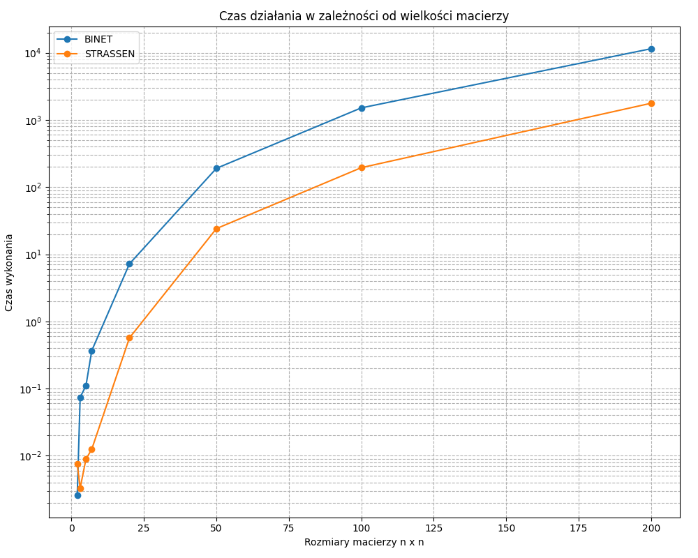
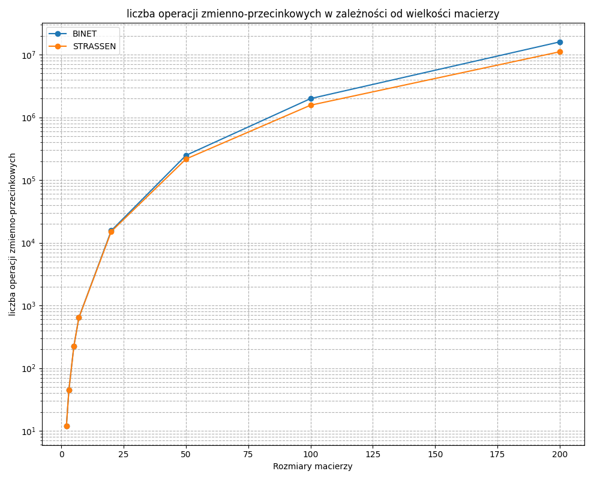

# Sprawozdanie — Lab 1: Rekurencyjne mnożenie macierzy (Binét, Strassen, AI)

Autorzy: Marek Swakoń, Szymon Tyburczy

## Cel i zakres

W ramach pierwszego zestawu zadań zaimplementowano i przeanalizowano trzy algorytmy mnożenia macierzy z losowymi wartościami z przedziału otwartego (0.00000001, 1.0):

- Rekurencyjne mnożenie macierzy metodą Binét’a
- Rekurencyjne mnożenie macierzy metodą Strassena
- Mnożenie macierzy metodą AI (na podstawie artykułu w Nature)

W trakcie eksperymentów zliczano liczbę operacji zmiennoprzecinkowych (dodawanie, odejmowanie, mnożenie, dzielenie) wykonywanych podczas mnożenia.

## Generowanie danych wejściowych

- Generator macierzy: wartości losowe z przedziału (0.00000001, 1.0), rozkład jednostajny.
- Rozmiary testowe: 1, 2, 3, …, 1000 (do maksymalnego N, który dało się policzyć na stanowisku).
- Warunki brzegowe: małe N (walidacja poprawności), duże N (pomiar wydajności i zużycia pamięci).

## Pseudokod (wysoki poziom)

### 1) Binét — rekurencyjne mnożenie

1. Wejście: Macierze A ∈ R^{m×k}, B ∈ R^{k×p}
2. Jeśli m ≤ 2 lub k ≤ 2 lub p ≤ 2: wykonaj naiwne (iteracyjne) mnożenie i zliczając operacje
3. Podziel A na 4 podmacierze: a11, a12, a21, a22
4. Podziel B na 4 podmacierze: b11, b12, b21, b22
5. Oblicz rekurencyjnie 8 iloczynów częściowych:
   - M1 = a11 \* b11
   - M2 = a12 \* b21
   - M3 = a11 \* b12
   - M4 = a12 \* b22
   - M5 = a21 \* b11
   - M6 = a22 \* b21
   - M7 = a21 \* b12
   - M8 = a22 \* b22
6. Złóż macierz C z sum częściowych:
   - c11 = M1 + M2
   - c12 = M3 + M4
   - c21 = M5 + M6
   - c22 = M7 + M8
7. Zwróć C

### 2) Strassen — rekurencyjne mnożenie

1. Wejście: A, B ∈ R^{N×N}
2. Dla N = 1: zwróć [A[0,0]·B[0,0]]
3. Dla N parzystego:
   - Podziel A i B na 4 podmacierze każda
   - Wyznacz pomocnicze sumy i różnice potrzebne do obliczenia M1…M7
   - Wyznacz 7 iloczynów pośrednich (M1…M7) zgodnie z klasycznym schematem Strassena
   - Złóż C z kombinacji M1…M7
4. Dla N nieparzystego:
   - Podziel A i B na 4 niesymetryczne bloki: główny (N-1)×(N-1), kolumnę (N-1)×1, wiersz 1×(N-1) i skalar 1×1
   - Wyznacz 4 bloki wynikowe (C11, C12, C21, C22) zgodnie ze standardową formułą mnożenia blokowego
   - Wyznacz iloczyn główny (A11B11) przez rekurencyjne wywołanie Strassena; pozostałe 7 iloczynów oblicz metodą iteracyjną
   - Złóż C z obliczonych bloków C11, C12, C21, C22
5. Zwróć C

### 3) Metoda AI (wg Nature)

##### Funkcja bazowa:

1. Wejście: macierz A [4×5], macierz B [5×5]:
2. Oblicz 76 wartości H, zgodnie z opisem metody z artykułu
3. Utwórz macierz C [4×5]
4. Wypełnij C kombinacjami wartości H, zgodnie z opisem metody z artykułu
5. Zwróć C

---

##### Funkcja rekurencyjna:

1. Sprawdź warunek bazowy: JEŻELI (M=4, K=5, P=5), ZWRÓĆ matrix_ai(A, B)
2. Sprawdź parzystość: JEŻELI (M, K lub P jest nieparzyste), ZGŁOŚ BŁĄD
3. Podziel A na 4 bloki: A11, A12, A21, A22
4. Podziel B na 4 bloki: B11, B12, B21, B22
5. Oblicz 8 iloczynów pośrednich przez rekurencyjne wywołania
6. Oblicz 4 bloki wynikowe przez sumowanie par (np. C11 = P1 + P2, C12 = P3 + P4, ...)
7. Złóż C [M×P] z bloków C11, C12, C21, C22
8. Zwróć C

## Najważniejsze fragmenty kodu

- Implementacja rekurencyjna Binét
- Implementacja Strassena (z obsługą brzegów lub informacją o ograniczeniach)
- Implementacja AI (oraz licznik operacji)

### Funkcje pomocnicze

- Funkcja generująca macierz o zadanych wymiarach z wartościami między 0.00000001 a 1.0

```cpp
Matrix createMatrix(size_t rows, size_t cols, bool random)
{
    Matrix mat(rows, std::vector<double>(cols, 0.0));
    if (random && rows > 0 && cols > 0)
    {
        unsigned seed = std::chrono::system_clock::now().time_since_epoch().count();
        std::mt19937 gen(seed);
        std::uniform_real_distribution<double> dis(0.00000001, 1.0);

        for (size_t i = 0; i < rows; ++i)
        {
            for (size_t j = 0; j < cols; ++j)
            {
                mat[i][j] = dis(gen);
            }
        }
    }
    return mat;
}
```

- Funkcja zwracająca podmacierz

```cpp
// wklej tu poprawioną funkcję subMatrix
```

- Funkcja dodająca dwie macierze i zliczająca operacje

```cpp
// wklej tu poprawioną funkcję addMatrices
```

- Funkcja odejmująca dwie macierze i zliczająca operacje

```cpp
// wklej tu poprawioną funkcję subtractMatrices
```

- Funkcja łącząca cztery podmacierze w jedną macierz

```cpp
// wklej tu poprawioną funkcję joinMatrices
```

- Funkcja zwracająca użycie pamięci w KB

```cpp
double printMemoryUsage()
{
    PROCESS_MEMORY_COUNTERS pmc;

    if (GetProcessMemoryInfo(GetCurrentProcess(), &pmc, sizeof(pmc)))
    {
        double peakMemoryKB = pmc.PeakWorkingSetSize / 1024.0;
        std::cout << "Memory Used: " << peakMemoryKB << " KB" << std::endl;
        return peakMemoryKB;
    }
    return 0;
}
```

- Funkcja mnożenia iteracyjnego z licznikiem operacji

```cpp
Matrix iterativeMultiply(const Matrix &A, const Matrix &B, unsigned long long &op_count)
{
    int m = A.size();
    int k = (m > 0) ? A[0].size() : 0;
    int p = (B.size() > 0) ? B[0].size() : 0;

    if (k != (int)B.size())
    {
        throw std::invalid_argument("Incompatible matrix dimensions for multiplication.");
    }

    Matrix C = createMatrix(m, p);
    for (int i = 0; i < m; ++i)
    {
        for (int j = 0; j < p; ++j)
        {
            double sum = 0.0;
            for (int l = 0; l < k; ++l)
            {
                sum += A[i][l] * B[l][j];
                op_count++;
            }
            C[i][j] = sum;
            if (k > 1)
            {
                op_count += (k - 1);
            }
        }
    }
    return C;
}
```

### Implementacja rekurencyjna Binét

```cpp
Matrix recursiveMultiply(const Matrix& A, const Matrix& B, unsigned long long& op_count) {
    int m = A.size();
    int k = (m > 0) ? A[0].size() : 0;
    int p = (B.size() > 0) ? B[0].size() : 0;

    if (m == 0 || k == 0 || p == 0) {
        return createMatrix(m, p);
    }

    if (m <= 2 || k <= 2 || p <= 2) {
        Matrix C_iter = createMatrix(m, p);
        for (int i = 0; i < m; ++i) {
            for (int j = 0; j < p; ++j) {
                double sum = 0.0;
                for (int l = 0; l < k; ++l) {
                    sum += A[i][l] * B[l][j];
                    op_count++;
                }
                C_iter[i][j] = sum;
                if (k > 1) {
                    op_count += (k - 1);
                }
            }
        }
        return C_iter;
    }

    int m_split = m / 2;
    int k_split = k / 2;
    int p_split = p / 2;

    Matrix a11 = subMatrix(A, 0, m_split, 0, k_split);
    Matrix a12 = subMatrix(A, 0, m_split, k_split, k);
    Matrix a21 = subMatrix(A, m_split, m, 0, k_split);
    Matrix a22 = subMatrix(A, m_split, m, k_split, k);

    Matrix b11 = subMatrix(B, 0, k_split, 0, p_split);
    Matrix b12 = subMatrix(B, 0, k_split, p_split, p);
    Matrix b21 = subMatrix(B, k_split, k, 0, p_split);
    Matrix b22 = subMatrix(B, k_split, k, p_split, p);

    Matrix c11_p1 = recursiveMultiply(a11, b11, op_count);
    Matrix c11_p2 = recursiveMultiply(a12, b21, op_count);

    Matrix c12_p1 = recursiveMultiply(a11, b12, op_count);
    Matrix c12_p2 = recursiveMultiply(a12, b22, op_count);

    Matrix c21_p1 = recursiveMultiply(a21, b11, op_count);
    Matrix c21_p2 = recursiveMultiply(a22, b21, op_count);

    Matrix c22_p1 = recursiveMultiply(a21, b12, op_count);
    Matrix c22_p2 = recursiveMultiply(a22, b22, op_count);

    Matrix c11 = addMatrices(c11_p1, c11_p2, op_count);
    Matrix c12 = addMatrices(c12_p1, c12_p2, op_count);
    Matrix c21 = addMatrices(c21_p1, c21_p2, op_count);
    Matrix c22 = addMatrices(c22_p1, c22_p2, op_count);

    Matrix C = createMatrix(m, p);
    joinMatrices(C, c11, c12, c21, c22, m_split, p_split);

    return C;
}
```

- wrapper funkcji rekurencyjnej Binét

```cpp
Matrix multiply_recursive_wrapper(const Matrix &A, const Matrix &B, unsigned long long &op_count)
{
    if (A.empty() || B.empty() || A[0].size() != B.size())
    {
        throw std::invalid_argument("Incompatible matrix dimensions for multiplication.");
    }

    op_count = 0;
    return recursiveMultiply(A, B, op_count);
}
```

### Implementacja rekurencyjna Strassena

```cpp
Matrix strassenRecursive(const Matrix &A, const Matrix &B, unsigned long long &op_count)
{
    int n = A.size();
    if (n == 1)
    {
        Matrix C = createMatrix(1, 1);
        C[0][0] = A[0][0] * B[0][0];
        op_count++;
        return C;
    }

    if (n % 2 == 0)
    {
        int n_split = n / 2;

        Matrix a11 = subMatrix(A, 0, n_split, 0, n_split);
        Matrix a12 = subMatrix(A, 0, n_split, n_split, n);
        Matrix a21 = subMatrix(A, n_split, n, 0, n_split);
        Matrix a22 = subMatrix(A, n_split, n, n_split, n);

        Matrix b11 = subMatrix(B, 0, n_split, 0, n_split);
        Matrix b12 = subMatrix(B, 0, n_split, n_split, n);
        Matrix b21 = subMatrix(B, n_split, n, 0, n_split);
        Matrix b22 = subMatrix(B, n_split, n, n_split, n);

        Matrix s1 = subtractMatrices(b12, b22, op_count);
        Matrix s2 = addMatrices(a11, a12, op_count);
        Matrix s3 = addMatrices(a21, a22, op_count);
        Matrix s4 = subtractMatrices(b21, b11, op_count);
        Matrix s5 = addMatrices(a11, a22, op_count);
        Matrix s6 = addMatrices(b11, b22, op_count);
        Matrix s7 = subtractMatrices(a12, a22, op_count);
        Matrix s8 = addMatrices(b21, b22, op_count);
        Matrix s9 = subtractMatrices(a11, a21, op_count);
        Matrix s10 = addMatrices(b11, b12, op_count);

        Matrix p1 = strassenRecursive(a11, s1, op_count);
        Matrix p2 = strassenRecursive(s2, b22, op_count);
        Matrix p3 = strassenRecursive(s3, b11, op_count);
        Matrix p4 = strassenRecursive(a22, s4, op_count);
        Matrix p5 = strassenRecursive(s5, s6, op_count);
        Matrix p6 = strassenRecursive(s7, s8, op_count);
        Matrix p7 = strassenRecursive(s9, s10, op_count);

        Matrix c11_p1 = addMatrices(p5, p4, op_count);
        Matrix c11_p2 = subtractMatrices(c11_p1, p2, op_count);
        Matrix c11 = addMatrices(c11_p2, p6, op_count);

        Matrix c12 = addMatrices(p1, p2, op_count);

        Matrix c21 = addMatrices(p3, p4, op_count);

        Matrix c22_p1 = addMatrices(p5, p1, op_count);
        Matrix c22_p2 = subtractMatrices(c22_p1, p3, op_count);
        Matrix c22 = subtractMatrices(c22_p2, p7, op_count);

        Matrix C = createMatrix(n, n);
        joinMatrices(C, c11, c12, c21, c22, n_split, n_split);

        return C;
    }

    else
    {
        int n1 = n - 1;

        Matrix A11 = subMatrix(A, 0, n1, 0, n1);
        Matrix a12 = subMatrix(A, 0, n1, n1, n);
        Matrix a21 = subMatrix(A, n1, n, 0, n1);
        Matrix a22 = subMatrix(A, n1, n, n1, n);

        Matrix B11 = subMatrix(B, 0, n1, 0, n1);
        Matrix b12 = subMatrix(B, 0, n1, n1, n);
        Matrix b21 = subMatrix(B, n1, n, 0, n1);
        Matrix b22 = subMatrix(B, n1, n, n1, n);

        Matrix C11_p1 = strassenRecursive(A11, B11, op_count);
        Matrix C11_p2 = iterativeMultiply(a12, b21, op_count);
        Matrix C11 = addMatrices(C11_p1, C11_p2, op_count);

        Matrix C12_p1 = iterativeMultiply(A11, b12, op_count);
        Matrix C12_p2 = iterativeMultiply(a12, b22, op_count);
        Matrix C12 = addMatrices(C12_p1, C12_p2, op_count);

        Matrix C21_p1 = iterativeMultiply(a21, B11, op_count);
        Matrix C21_p2 = iterativeMultiply(a22, b21, op_count);
        Matrix C21 = addMatrices(C21_p1, C21_p2, op_count);

        Matrix C22_p1 = iterativeMultiply(a21, b12, op_count);
        Matrix C22_p2 = iterativeMultiply(a22, b22, op_count);
        Matrix C22 = addMatrices(C22_p1, C22_p2, op_count);

        Matrix C = createMatrix(n, n);
        joinMatrices(C, C11, C12, C21, C22, n1, n1);

        return C;
    }
}
```

- wrapper funkcji rekurencyjnej Strassena

```cpp
Matrix multiply_strassen_wrapper(const Matrix &A, const Matrix &B, unsigned long long &op_count)
{
    if (A.empty() || B.empty() || A[0].size() != B.size())
    {
        throw std::invalid_argument("Incompatible matrix dimensions for multiplication.");
    }
    if (A.size() != A[0].size() || B.size() != B[0].size() || A.size() != B.size())
    {
        throw std::invalid_argument("Input matrices are not square and of the same size N.");
    }

    op_count = 0;
    return strassenRecursive(A, B, op_count);
}
```

### Implementacja metody AI

- Funkcja bazowa mnożąca macierz 4×5 przez 5×5

```cpp
Matrix matrix_ai(const Matrix &A, const Matrix &B, unsigned long long &op_count)
{
    assert(A.size() == 4 && A[0].size() == 5 && "Matrix A must be 4x5");
    assert(B.size() == 5 && B[0].size() == 5 && "Matrix B must be 5x5");

    op_count = 0;
    std::vector<double> H(76);

    // Compute H values (as in article)
    H[0] = A[2][1] * (-B[1][0] - B[1][4] - B[2][0]);
    op_count += 3;
    H[1] = (A[1][1] + A[1][4] - A[2][4]) * (-B[1][4] - B[4][0]);
    op_count += 4;
    H[2] = (-A[2][0] - A[3][0] + A[3][1]) * (-B[0][0] + B[1][4]);
    op_count += 4;
    H[3] = (A[0][1] + A[0][3] + A[2][3]) * (-B[1][4] - B[3][0]);
    op_count += 4;
    H[4] = (A[0][4] + A[1][1] + A[1][4]) * (-B[1][3] + B[4][0]);
    op_count += 4;
    H[5] = (-A[1][1] - A[1][4] - A[3][4]) * (B[1][2] + B[4][0]);
    op_count += 4;
    H[6] = (-A[0][0] + A[3][0] - A[3][1]) * (B[0][0] + B[1][3]);
    op_count += 4;
    H[7] = (A[2][1] - A[2][2] - A[3][2]) * (-B[1][2] + B[2][0]);
    op_count += 4;
    H[8] = (-A[0][1] - A[0][3] + A[3][3]) * (B[1][2] + B[3][0]);
    op_count += 4;
    H[9] = (A[1][1] + A[1][4]) * B[4][0];
    op_count += 2;
    H[10] = (-A[1][0] - A[3][0] + A[3][1]) * (-B[0][0] + B[1][1]);
    op_count += 4;
    H[11] = (A[3][0] - A[3][1]) * B[0][0];
    op_count += 2;
    H[12] = (A[0][1] + A[0][3] + A[1][3]) * (B[1][1] + B[3][0]);
    op_count += 4;
    H[13] = (A[0][2] - A[2][1] + A[2][2]) * (B[1][3] + B[2][0]);
    op_count += 4;
    H[14] = (-A[0][1] - A[0][3]) * B[3][0];
    op_count += 2;
    H[15] = (-A[2][1] + A[2][2]) * B[2][0];
    op_count += 2;
    H[16] = (A[0][1] + A[0][3] - A[1][0] + A[1][1] - A[1][2] + A[1][3] - A[2][1] + A[2][2] - A[3][0] + A[3][1]) * B[1][1];
    op_count += 10;
    H[17] = A[1][0] * (B[0][0] + B[0][1] + B[4][1]);
    op_count += 3;
    H[18] = -A[1][2] * (B[2][0] + B[2][1] + B[4][1]);
    op_count += 3;
    H[19] = (-A[0][4] + A[1][0] + A[1][2] - A[1][4]) * (-B[0][0] - B[0][1] + B[0][3] - B[4][1]);
    op_count += 8;
    H[20] = (A[1][0] + A[1][2] - A[1][4]) * B[4][1];
    op_count += 3;
    H[21] = (A[0][2] - A[0][3] - A[1][3]) * (B[0][0] + B[0][1] - B[0][3] - B[2][0] - B[2][1] + B[2][3] + B[3][3]);
    op_count += 9;
    H[22] = A[0][2] * (-B[2][0] + B[2][3] + B[3][3]);
    op_count += 3;
    H[23] = A[0][4] * (-B[3][3] - B[4][0] + B[4][3]);
    op_count += 3;
    H[24] = -A[0][0] * (B[0][0] - B[0][3]);
    op_count += 2;
    H[25] = (-A[0][2] + A[0][3] + A[0][4]) * B[3][3];
    op_count += 3;
    H[26] = (A[0][2] - A[2][0] + A[2][2]) * (B[0][0] - B[0][3] + B[0][4] + B[2][4]);
    op_count += 6;
    H[27] = -A[2][3] * (-B[2][4] - B[3][0] - B[3][4]);
    op_count += 3;
    H[28] = A[2][0] * (B[0][0] + B[0][4] + B[2][4]);
    op_count += 3;
    H[29] = (A[2][0] - A[2][2] + A[2][3]) * B[2][4];
    op_count += 3;
    H[30] = (-A[0][3] - A[0][4] - A[2][3]) * (-B[3][3] - B[4][0] + B[4][3] - B[4][4]);
    op_count += 7;
    H[31] = (A[1][0] + A[3][0] + A[3][3]) * (B[0][2] - B[3][0] - B[3][1] - B[3][2]);
    op_count += 6;
    H[32] = A[3][2] * (-B[2][0] - B[2][2]);
    op_count += 2;
    H[33] = A[3][3] * (-B[0][2] + B[3][0] + B[3][2]);
    op_count += 3;
    H[34] = -A[3][4] * (B[0][2] + B[4][0] + B[4][2]);
    op_count += 3;
    H[35] = (A[1][2] - A[1][4] - A[3][4]) * (B[2][0] + B[2][1] + B[2][2] + B[4][1]);
    op_count += 6;
    H[36] = (-A[3][0] - A[3][3] + A[3][4]) * B[0][2];
    op_count += 3;
    H[37] = (-A[1][2] - A[2][0] + A[2][2] - A[2][3]) * (B[2][4] + B[3][0] + B[3][1] + B[3][4]);
    op_count += 7;
    H[38] = (-A[2][0] - A[3][0] - A[3][3] + A[3][4]) * (B[0][2] + B[4][0] + B[4][2] + B[4][4]);
    op_count += 7;
    H[39] = (-A[0][2] + A[0][3] + A[0][4] - A[3][3]) * (-B[2][0] - B[2][2] + B[2][3] + B[3][3]);
    op_count += 7;
    H[40] = (-A[0][0] + A[3][0] - A[3][4]) * (B[0][2] + B[2][0] + B[2][2] - B[2][3] + B[4][0] + B[4][2] - B[4][3]);
    op_count += 9;
    H[41] = (-A[1][0] + A[1][4] - A[2][4]) * (-B[0][0] - B[0][1] - B[0][4] + B[3][0] + B[3][1] + B[3][4] - B[4][1]);
    op_count += 10;
    H[42] = A[1][3] * (B[3][0] + B[3][1]);
    op_count += 2;
    H[43] = (A[1][2] + A[2][1] - A[2][2]) * (B[1][1] - B[2][0]);
    op_count += 4;
    H[44] = (-A[2][2] + A[2][3] - A[3][2]) * (B[2][4] + B[3][0] + B[3][2] + B[3][4] + B[4][0] + B[4][2] + B[4][4]);
    op_count += 9;
    H[45] = -A[2][4] * (-B[4][0] - B[4][4]);
    op_count += 2;
    H[46] = (A[1][0] - A[1][4] - A[2][0] + A[2][4]) * (B[0][0] + B[0][1] + B[0][4] - B[3][0] - B[3][1] - B[3][4]);
    op_count += 9;
    H[47] = (-A[1][2] + A[2][2]) * (B[1][1] + B[2][1] + B[2][4] + B[3][0] + B[3][1] + B[3][4]);
    op_count += 7;
    H[48] = (-A[0][0] - A[0][2] + A[0][3] + A[0][4] - A[1][0] - A[1][2] + A[1][3] + A[1][4]) * (-B[0][0] - B[0][1] + B[0][3]);
    op_count += 11;
    H[49] = (-A[0][3] - A[1][3]) * (B[1][1] - B[2][0] - B[2][1] + B[2][3] - B[3][1] + B[3][3]);
    op_count += 7;
    H[50] = A[1][1] * (B[1][0] + B[1][1] - B[4][0]);
    op_count += 3;
    H[51] = A[3][1] * (B[0][0] + B[1][0] + B[1][2]);
    op_count += 3;
    H[52] = -A[0][1] * (-B[1][0] + B[1][3] + B[3][0]);
    op_count += 3;
    H[53] = (A[0][1] + A[0][3] - A[1][1] - A[1][4] - A[2][1] + A[2][2] - A[3][1] + A[3][2] - A[3][3] - A[3][4]) * B[1][2];
    op_count += 10;
    H[54] = (A[0][3] - A[3][3]) * (-B[1][2] + B[2][0] + B[2][2] - B[2][3] + B[3][2] - B[3][3]);
    op_count += 7;
    H[55] = (A[0][0] - A[0][4] - A[3][0] + A[3][4]) * (B[2][0] + B[2][2] - B[2][3] + B[4][0] + B[4][2] - B[4][3]);
    op_count += 9;
    H[56] = (-A[2][0] - A[3][0]) * (-B[0][2] - B[0][4] - B[1][4] - B[4][0] - B[4][2] - B[4][4]);
    op_count += 7;
    H[57] = (-A[0][3] - A[0][4] - A[2][3] - A[2][4]) * (-B[4][0] + B[4][3] - B[4][4]);
    op_count += 6;
    H[58] = (-A[2][2] + A[2][3] - A[3][2] + A[3][3]) * (B[3][0] + B[3][2] + B[3][4] + B[4][0] + B[4][2] + B[4][4]);
    op_count += 9;
    H[59] = (A[1][4] + A[3][4]) * (B[1][2] - B[2][0] - B[2][1] - B[2][2] - B[4][1] - B[4][2]);
    op_count += 7;
    H[60] = (A[0][3] + A[2][3]) * (B[0][0] - B[0][3] + B[0][4] - B[1][4] - B[3][3] + B[3][4] - B[4][0] + B[4][3] - B[4][4]);
    op_count += 10;
    H[61] = (A[1][0] + A[3][0]) * (B[0][1] + B[0][2] + B[1][1] - B[3][0] - B[3][1] - B[3][2]);
    op_count += 7;
    H[62] = (-A[2][2] - A[3][2]) * (-B[1][2] - B[2][2] - B[2][4] - B[3][0] - B[3][2] - B[3][4]);
    op_count += 7;
    H[63] = (A[0][0] - A[0][2] - A[0][3] + A[2][0] - A[2][2] - A[2][3]) * (B[0][0] - B[0][3] + B[0][4]);
    op_count += 8;
    H[64] = (-A[0][0] + A[3][0]) * (-B[0][2] + B[0][3] + B[1][3] - B[4][0] - B[4][2] + B[4][3]);
    op_count += 7;
    H[65] = (A[0][0] - A[0][1] + A[0][2] - A[0][4] - A[1][1] - A[1][4] - A[2][1] + A[2][2] - A[3][0] + A[3][1]) * B[1][3];
    op_count += 10;
    H[66] = (A[1][4] - A[2][4]) * (B[0][0] + B[0][1] + B[0][4] - B[1][4] - B[3][0] - B[3][1] - B[3][4] + B[4][1] + B[4][4]);
    op_count += 10;
    H[67] = (A[0][0] + A[0][2] - A[0][3] - A[0][4] - A[3][0] - A[3][2] + A[3][3] + A[3][4]) * (-B[2][0] - B[2][2] + B[2][3]);
    op_count += 10;
    H[68] = (-A[0][2] + A[0][3] - A[1][2] + A[1][3]) * (-B[1][3] - B[2][0] - B[2][1] + B[2][3] - B[4][1] + B[4][3]);
    op_count += 9;
    H[69] = (A[1][2] - A[1][4] + A[3][2] - A[3][4]) * (-B[2][0] - B[2][1] - B[2][2]);
    op_count += 6;
    H[70] = (-A[2][0] + A[2][2] - A[2][3] + A[2][4] - A[3][0] + A[3][2] - A[3][3] + A[3][4]) * (-B[4][0] - B[4][2] - B[4][4]);
    op_count += 10;
    H[71] = (-A[1][0] - A[1][3] - A[3][0] - A[3][3]) * (B[3][0] + B[3][1] + B[3][2]);
    op_count += 6;
    H[72] = (A[0][2] - A[0][3] - A[0][4] + A[1][2] - A[1][3] - A[1][4]) * (B[0][0] + B[0][1] - B[0][3] + B[1][3] + B[4][1] - B[4][3]);
    op_count += 11;
    H[73] = (A[1][0] - A[1][2] + A[1][3] - A[2][0] + A[2][2] - A[2][3]) * (B[3][0] + B[3][1] + B[3][4]);
    op_count += 8;
    H[74] = -(A[0][1] + A[0][3] - A[1][1] - A[1][4] - A[2][0] + A[2][1] + A[2][3] + A[2][4] - A[3][0] + A[3][1]) * B[1][4];
    op_count += 10;
    H[75] = (A[0][2] + A[2][2]) * (-B[0][0] + B[0][3] - B[0][4] + B[1][3] + B[2][3] - B[2][4]);
    op_count += 7;

    // Compute the resulting matrix C (4x5)
    Matrix C = createMatrix(4, 5);

    C[0][0] = -H[9] + H[11] + H[13] - H[14] - H[15] + H[52] + H[4] - H[65] - H[6];
    op_count += 8;
    C[1][0] = H[9] + H[10] - H[11] + H[12] + H[14] + H[15] - H[16] - H[43] + H[50];
    op_count += 8;
    C[2][0] = H[9] - H[11] + H[14] + H[15] - H[0] + H[1] + H[2] - H[3] + H[74];
    op_count += 8;
    C[3][0] = -H[9] + H[11] - H[14] - H[15] + H[51] + H[53] - H[5] - H[7] + H[8];
    op_count += 8;
    C[0][1] = H[12] + H[14] + H[19] + H[20] - H[21] + H[22] + H[24] - H[42] + H[48] + H[49];
    op_count += 9;
    C[1][1] = -H[10] + H[11] - H[12] - H[14] - H[15] + H[16] + H[17] - H[18] - H[20] + H[42] + H[43];
    op_count += 10;
    C[2][1] = -H[15] - H[18] - H[20] - H[27] - H[28] - H[37] + H[41] + H[43] - H[46] + H[47];
    op_count += 9;
    C[3][1] = H[10] - H[11] - H[17] + H[20] - H[31] + H[32] - H[33] - H[35] + H[61] - H[69];
    op_count += 9;
    C[0][2] = H[14] + H[22] + H[23] + H[33] - H[36] + H[39] - H[40] + H[54] - H[55] - H[8];
    op_count += 9;
    C[1][2] = -H[9] + H[18] + H[31] + H[34] + H[35] + H[36] - H[42] - H[59] - H[5] - H[71];
    op_count += 9;
    C[2][2] = -H[15] - H[27] + H[32] + H[36] - H[38] + H[44] - H[45] + H[62] - H[70] - H[7];
    op_count += 9;
    C[3][2] = H[9] + H[14] + H[15] - H[32] + H[33] - H[34] - H[36] - H[53] + H[5] + H[7] - H[8];
    op_count += 10;
    C[0][3] = -H[9] + H[11] + H[13] - H[15] + H[22] + H[23] + H[24] + H[25] + H[4] - H[65] - H[6];
    op_count += 10;
    C[1][3] = H[9] + H[17] - H[18] + H[19] - H[21] - H[23] - H[25] - H[4] - H[68] + H[72];
    op_count += 9;
    C[2][3] = -H[13] + H[15] - H[22] - H[25] + H[26] + H[28] + H[30] + H[45] - H[57] + H[75];
    op_count += 9;
    C[3][3] = H[11] + H[24] + H[25] - H[32] - H[34] - H[39] + H[40] + H[64] - H[67] - H[6];
    op_count += 9;
    C[0][4] = H[14] + H[23] + H[24] + H[26] - H[27] + H[29] + H[30] - H[3] + H[60] + H[63];
    op_count += 9;
    C[1][4] = -H[9] - H[17] - H[1] - H[29] - H[37] + H[41] - H[42] + H[45] + H[66] + H[73];
    op_count += 9;
    C[2][4] = -H[9] + H[11] - H[14] + H[27] + H[28] - H[1] - H[29] - H[2] + H[45] + H[3] - H[74];
    op_count += 10;
    C[3][4] = -H[11] - H[28] + H[29] - H[33] + H[34] + H[38] + H[2] - H[44] + H[56] + H[58];
    op_count += 9;

    return C;
}
```

- Rekurencyjna funkcja mnożąca macierze za pomocą metody AI

```cpp
Matrix multiply_ai_recursive(const Matrix &A, const Matrix &B, unsigned long long &op_count)
{
    const int M_BASE = 4;
    const int K_BASE = 5;
    const int P_BASE = 5;

    int M = A.size();
    int K = (M > 0) ? A[0].size() : 0;
    int P = (B.size() > 0) ? B[0].size() : 0;

    if (M == M_BASE && K == K_BASE && B.size() == K_BASE && P == P_BASE)
    {
        unsigned long long temp_ops = 0;
        Matrix C = matrix_ai(A, B, temp_ops);
        op_count += temp_ops;
        return C;
    }

    int m_split = M / 2;
    int k_split = K / 2;
    int p_split = P / 2;

    // Check for odd dimensions
    if (M % 2 != 0 || K % 2 != 0 || P % 2 != 0)
    {
        std::cerr << "Error: Matrix dimensions (" << M << "x" << K << ") * ("
                  << K << "x" << P << "). "
                  << "Matrix does not have appropriate dimensions for this algorithm." << std::endl;
        throw std::invalid_argument("Matrix does not have appropriate dimensions for this algorithm.");
    }

    // Subdivide A into 4 blocks
    Matrix a11 = subMatrix(A, 0, m_split, 0, k_split);
    Matrix a12 = subMatrix(A, 0, m_split, k_split, K);
    Matrix a21 = subMatrix(A, m_split, M, 0, k_split);
    Matrix a22 = subMatrix(A, m_split, M, k_split, K);

    Matrix b11 = subMatrix(B, 0, k_split, 0, p_split);
    Matrix b12 = subMatrix(B, 0, k_split, p_split, P);
    Matrix b21 = subMatrix(B, k_split, K, 0, p_split);
    Matrix b22 = subMatrix(B, k_split, K, p_split, P);

    // 8 recursive calls
    Matrix c11_p1 = multiply_ai_recursive(a11, b11, op_count);
    Matrix c11_p2 = multiply_ai_recursive(a12, b21, op_count);

    Matrix c12_p1 = multiply_ai_recursive(a11, b12, op_count);
    Matrix c12_p2 = multiply_ai_recursive(a12, b22, op_count);

    Matrix c21_p1 = multiply_ai_recursive(a21, b11, op_count);
    Matrix c21_p2 = multiply_ai_recursive(a22, b21, op_count);

    Matrix c22_p1 = multiply_ai_recursive(a21, b12, op_count);
    Matrix c22_p2 = multiply_ai_recursive(a22, b22, op_count);

    Matrix c11 = addMatrices(c11_p1, c11_p2, op_count);
    Matrix c12 = addMatrices(c12_p1, c12_p2, op_count);
    Matrix c21 = addMatrices(c21_p1, c21_p2, op_count);
    Matrix c22 = addMatrices(c22_p1, c22_p2, op_count);

    Matrix C = createMatrix(M, P);
    joinMatrices(C, c11, c12, c21, c22, m_split, p_split);

    return C;
```

## Metodologia pomiarowa

- Czas: std::chrono::high_resolution_clock (średnia z ≥3 powtórzeń na punkt)
- Operacje: ręcznie inkrementowany licznik przy każdej operacji +, −, ·, /
- Pamięć: WinAPI (GetProcessMemoryInfo / PSAPI) lub odpowiednik; raport w KB
- Walidacja: porównanie wyników z wersją iteracyjną O(N^3) przy tolerancji ϵ = 1e−9

Format wyników (CSV):

```

Size,Algorithm,Operations,Duration_ms,Memory_kb
16,Strassen,XXXX,YY.Y,ZZZZ
...

```

Pliki CSV w repozytorium:

- `matrix_multiplication_results_BINET.csv`
- `matrix_multiplication_results_STRASSEN.csv`
- `matrix_multiplication_results_AlphaTensor.csv` lub `ai_recursive_benchmark.csv`

---

## Wyniki i wykresy

Wstaw wykresy (lub podlinkuj pliki PNG) dla zakresu N = 1…N_max:

1. Czas działania (ms) vs. rozmiar macierzy (oś X)



2. Liczba operacji zmiennoprzecinkowych vs. rozmiar



3. Zużycie pamięci (KB) vs. rozmiar


Tabela przykładowa (fragment):

| N   | Algorytm | Operacje [#] | Czas [ms] | Pamięć [KB] |
| --- | -------- | ------------ | --------- | ----------- |
| 16  | Binét    | …            | …         | …           |
| 16  | Strassen | …            | …         | …           |
| 16  | AI       | …            | …         | …           |

---

## Ograniczenia, błędy i obsługa przypadków brzegowych

- Brak paddingu: jeżeli algorytm wymaga specyficznych wymiarów (np. parzyste N), program powinien zakończyć pracę i wypisać czytelny komunikat (bez sztucznego dopełniania).
- Stabilność numeryczna: porównania wyników z tolerancją ϵ.
- Zużycie pamięci: opis ewentualnych pików pamięci i ich przyczyn.

---

## Szacowanie złożoności obliczeniowej

- Binét: … (wyprowadzenie/odwołanie do literatury) — eksperymentalne dopasowanie krzywej
- Strassen: O(N^{log₂7}) ≈ O(N^{2.807}); pomiar vs. teoria
- AI: opis przewidywanej złożoności i obserwacje eksperymentalne

Metoda estymacji: regresja log–log (czas/operacje vs. N), wykres trendu i współczynnik R².

---

## Walidacja poprawności

- Testy małych rozmiarów (N=2,3,5,7,…) — porównanie z implementacją iteracyjną
- Dodatkowo testy losowe dla kilku N, weryfikacja normy błędu ||C_ref − C||\_F

---

## Instrukcja uruchomienia (Windows, PowerShell)

Kompilacja (MSYS2/MinGW, C++17):

```powershell
g++ -std=c++17 -O2 -Wall -Wextra -DNOMINMAX -o matrix_Binet.exe matrix_Binet.cpp -lpsapi
g++ -std=c++17 -O2 -Wall -Wextra -DNOMINMAX -o matrix_Strassen.exe matrix_Strassen.cpp -lpsapi
g++ -std=c++17 -O2 -Wall -Wextra -DNOMINMAX -o matrix_ai.exe matrix_ai.cpp -lpsapi
```

Uruchomienie:

```powershell
./matrix_Binet.exe
./matrix_Strassen.exe
./matrix_ai.exe
```

Skrypt z wykresami (opcjonalnie):

```powershell
py ./Binet_Strassen.py
```

---

## Dyskusja i wnioski

- Porównanie osiągów (czas, operacje, pamięć) między Binét / Strassen / AI
- Kiedy który algorytm jest korzystny i dlaczego
- Wpływ ograniczeń (brak paddingu) na implementację i wyniki
- Potencjalne kierunki optymalizacji

---

## Bibliografia

1. Volker Strassen, Gaussian Elimination is Not Optimal, 1969
2. Artykuł „Nature” dot. mnożenia macierzy metodą AI — pełny cytat
3. Inne źródła (podręczniki, wykłady, wpisy blogowe) — pełne odniesienia

---

Checklist (do odhaczenia przed oddaniem):

- [ ] Pseudokod obu algorytmów rekurencyjnych
- [ ] Fragmenty kodu (najważniejsze miejsca)
- [ ] Wykresy: czas, operacje, pamięć (1…N_max)
- [ ] CSV z wynikami dołączone do repo
- [ ] Oszacowanie złożoności (teoria/eksperyment)
- [ ] Walidacja poprawności na małych N
- [ ] Opis ograniczeń i braku paddingu
