# Sprawozdanie — Lab 2: Eliminacja gaussa, faktoryzacja LU, odwracanie macierzy

Autorzy: Marek Swakoń, Szymon Tyburczy

## Cel i zakres

W ramach drugiego zestawu zadań zaimplementowano i przeanalizowano trzy algorytmy operujące na macierzach z losowymi wartościami z przedziału otwartego (0.00000001, 1.0):

- Rekurencyjna faktoryzacja LU
- Rekurencyjna eliminacja Gaussa
- Rekurencyjne odwracanie macierzy

W trakcie eksperymentów zliczano liczbę operacji zmiennoprzecinkowych (dodawanie, odejmowanie, mnożenie, dzielenie) wykonywanych podczas mnożenia.

## Generowanie danych wejściowych

- Generator macierzy: wartości losowe z przedziału (0.00000001, 1.0), rozkład jednostajny.
- Rozmiary testowe: 1, 2, 3, …, 1000 (do maksymalnego N, który dało się policzyć na stanowisku).
- Warunki brzegowe: małe N (walidacja poprawności), duże N (pomiar wydajności i zużycia pamięci).

## Pseudokod (wysoki poziom)

### 1) Rekurencyjna faktoryzacja LU

Funkcja FaktoryzacjaLU(A): (Gdzie A to macierz n×n. Zwraca obiekt: {L, U, det})

    Warunek bazowy (Trywialny przypadek):

        Jeśli A jest macierzą 1×1 (liczba a):

            Jeśli a jest bliskie zera, zgłoś błąd.

            Zwróć {L: [[1.0]], U: [[a]], det: a}.

        KONIEC IF

    Podział na bloki:

        Podziel A na cztery bloki: A11​,A12​,A21​,A22​.

    Krok 1: Rekurencja dla A11​

        Wynik1 = FaktoryzacjaLU(A11)

        Pobierz L11 = Wynik1.L, U11 = Wynik1.U, det1 = Wynik1.det.

    Krok 2: Obliczenie L21​ i U12​

        U12 = Rozwiąż_Dolnotrójkątne(L11, A12)

        L21 = Rozwiąż_Górnotrójkątne(A21, U11)

    Krok 3: Dopełnienie Schura i Rekurencja dla S

        S = A22 - (L21 * U12)

        Wynik2 = FaktoryzacjaLU(S)

        Pobierz L22 = Wynik2.L, U22 = Wynik2.U, det2 = Wynik2.det.

    Krok 4: Obliczenie Wyznacznika

        Wyznacznik macierzy blokowo-trójkątnej to iloczyn wyznaczników bloków na diagonali.

        det(A)=det(L)⋅det(U)

        det(L)=det(L11​)⋅det(L22​)=1⋅1=1 (bo L ma jedynki na diagonali)

        det(U)=det(U11​)⋅det(U22​)

        Z kroku 1 wiemy, że det(A11​)=det(L11​)⋅det(U11​)=1⋅det(U11​), więc det(U11​)=det1.

        Z kroku 3 wiemy, że det(S)=det(L22​)⋅det(U22​)=1⋅det(U22​), więc det(U22​)=det2.

        det_finalny = det1 * det2

    Złożenie Wyniku:

        Stwórz macierze L i U.

        Skopiuj bloki L11​,L21​,L22​ oraz U11​,U12​,U22​ na odpowiednie miejsca.

        Zwróć {L, U, det_finalny}.

### 2) Rekurencyjna eliminacja Gaussa

Funkcja Rozwiaz(A, b): (Gdzie A to macierz n×n, a b to wektor n×1)

    Warunek bazowy (Trywialny przypadek):

        Jeśli macierz A jest wystarczająco mała (np. 1×1 lub mniejsza niż ustalony block_size), rozwiąż Ax=b bezpośrednio (np. klasyczną eliminacją Gaussa) i zwróć x.

    Podział na bloki:

        Podziel A na cztery bloki: A11​,A12​,A21​,A22​.

        Podziel x na dwa bloki: x1​,x2​.

        Podziel b na dwa bloki: b1​,b2​.

        Mamy teraz układ równań:

            A11​⋅x1​+A12​⋅x2​=b1​

            A21​⋅x1​+A22​⋅x2​=b2​

    Krok Eliminacji (przekształcenie układu):

        Cel: Wyeliminować x1​ z drugiego równania, aby znaleźć x2​.

        Działanie:

            Znajdź A11−1​ (w praktyce: policz rozkład L11​U11​=A11​).

            Oblicz dopełnienie Schura (S): S=A22​−A21​⋅(A11−1​⋅A12​)

            Oblicz "poprawkę" dla wektora b: b′=b2​−A21​⋅(A11−1​⋅b1​)


    Krok Rekurencji:

        Po eliminacji, drugie równanie sprowadza się do: S⋅x2​=b′.

        Rozwiąż ten mniejszy problem rekurencyjnie: x2 = Rozwiaz(S, b')

    Krok Wstecznego Podstawienia:

        Teraz, gdy mamy x2​, możemy znaleźć x1​ z pierwszego równania: A11​⋅x1​=b1​−A12​⋅x2​

        Rozwiąż ten układ względem x1​ (używając wcześniej policzonego rozkładu L11​U11​): x1 = Rozwiaz(A11, b1 - A12 * x2)

    Złożenie Wyniku:

        Połącz x1 i x2 w jeden wektor x.

        Zwróć x.

### 3) Rekurencyjne odwracanie macierzy

Funkcja Odwróć(A): (Gdzie A to macierz n×n)

    Warunek bazowy (Trywialny przypadek):

        Jeśli A jest macierzą 1×1 (czyli liczbą a):

            Jeśli a jest bliskie zera, zgłoś błąd (macierz osobliwa).

            Zwróć macierz 1×1 zawierającą [1/a].

        KONIEC IF

    Podział na bloki:

        Podziel A na cztery równe (lub prawie równe) bloki:

            A11​ (lewy górny)

            A12​ (prawy górny)

            A21​ (lewy dolny)

            A22​ (prawy dolny)

    Krok 1: Obliczenia rekurencyjne (podstawowe)

        Oblicz A11−1​ (odwrotność lewego górnego bloku): Inv_A11 = Odwróć(A11)

        Oblicz dopełnienie Schura (S):

            Temp1 = A21 * Inv_A11

            Temp2 = Temp1 * A12

            S = A22 - Temp2

        Oblicz S−1 (odwrotność dopełnienia Schura): Inv_S = Odwróć(S)

    Krok 2: Obliczanie bloków macierzy wynikowej B

        (Gdzie B=A−1 i jest również podzielona na bloki B11​,B12​,B21​,B22​)

        Oblicz B22​: B22 = Inv_S

        Oblicz B12​:

            Temp3 = Inv_A11 * A12

            B12 = -1 * (Temp3 * Inv_S)

        Oblicz B21​:

            B21 = -1 * (Inv_S * Temp1)

        Oblicz B11​:

            Temp4 = Temp3 * B21

            B11 = Inv_A11 - Temp4

    Złożenie Wyniku:

        Stwórz nową macierz B o rozmiarze n×n.

        Skopiuj B11​,B12​,B21​,B22​ na odpowiednie miejsca w B.

        Zwróć B.

## Najważniejsze fragmenty kodu

- Implementacja rekurencyjna faktoryzacji LU
- Implementacja rekurencyjna eliminacji Gaussa
- Implementacja rekurencyjna odwracania macierzy

### Funkcje pomocnicze

- Większość funkcji pomocniczych pochodzi z laboratorium 1, więc opisane są w poprzednim sprawozdaniu. Poniżej zamieszczono jedynie nowe funkcje.

- Funkcja rozwiązująca układ równań z macierzą dolnotrójkątną i zliczająca operacje

```cpp
std::vector<double> solve_lower_triangular(const Matrix &L, const std::vector<double> &b, unsigned long long &op_count)
{
    size_t n = L.size();
    if (n == 0)
        return {};
    if (n != b.size() || n != L[0].size())
    {
        throw std::runtime_error("Incompatible matrix/vector dimensions in solve_lower_triangular");
    }

    std::vector<double> x(n);

    for (size_t i = 0; i < n; ++i)
    {
        double sum = 0.0;
        for (size_t j = 0; j < i; ++j)
        {
            sum += L[i][j] * x[j];
            op_count += 2;
        }

        if (fabs(L[i][i]) < EPS)
        {
            throw std::runtime_error("Division by zero: singular triangular matrix.");
        }

        x[i] = (b[i] - sum) / L[i][i];
        op_count += 2;
    }

    return x;
}
```

- Funkcja rozwiązująca układ równań z macierzą górnotrójkątną i zliczająca operacje

```cpp
std::vector<double> solve_upper_triangular(const Matrix &U, const std::vector<double> &b, unsigned long long &op_count)
{
    size_t n = U.size();
    if (n == 0)
        return {};
    if (n != b.size() || n != U[0].size())
    {
        throw std::runtime_error("Incompatible matrix/vector dimensions in solve_upper_triangular");
    }

    std::vector<double> x(n);

    for (size_t i = n; i-- > 0;)
    {
        double sum = 0.0;
        for (size_t j = i + 1; j < n; ++j)
        {
            sum += U[i][j] * x[j];
            op_count += 2;
        }

        if (fabs(U[i][i]) < EPS)
        {
            throw std::runtime_error("Division by zero: singular triangular matrix.");
        }
        x[i] = (b[i] - sum) / U[i][i];
        op_count += 2;
    }

    return x;
}
```

### Implementacja rekurencyjna faktoryzacji LU

- Funkcja rozwiązująca układ równań z macierzą lewostronnie jednostronnie dolnotrójkątną i zliczająca operacje

```cpp
Matrix solve_left_unit_lower_triangular(const Matrix &L, const Matrix &B, unsigned long long &op_count)
{
    int n = L.size();
    int m = B[0].size();
    Matrix X = createMatrix(n, m);
    for (int j = 0; j < m; ++j)
    {
        for (int i = 0; i < n; ++i)
        {
            double sum = 0.0;
            for (int k = 0; k < i; ++k)
            {
                sum += L[i][k] * X[k][j];
                op_count += 2;
            }
            X[i][j] = B[i][j] - sum;
            op_count++;
        }
    }
    return X;
}
```

- Funkcja rozwiązująca układ równań z macierzą prawostronnie jednostronnie górnotrójkątną i zliczająca operacje

```cpp
Matrix solve_right_upper_triangular(const Matrix &A, const Matrix &U, unsigned long long &op_count)
{
    int n = U.size();
    int m = A.size();
    Matrix X = createMatrix(m, n);

    for (int i = 0; i < m; ++i)
    {
        for (int j = 0; j < n; ++j)
        {
            double sum = 0.0;
            for (int k = 0; k < j; ++k)
            {
                sum += X[i][k] * U[k][j];
                op_count += 2;
            }

            if (fabs(U[j][j]) < EPS)
            {
                throw std::runtime_error("Zero diagonal element in solve_right_upper_triangular.");
            }

            X[i][j] = (A[i][j] - sum) / U[j][j];
            op_count += 2;
        }
    }
    return X;
}
```

- Rekurencyjna faktoryzacja LU z zliczaniem operacji

```cpp
LU_Result recursive_lu_factorization(const Matrix &A, unsigned long long &op_count,
                                     MultiplyAlgorithm algo)
{
    int n = A.size();
    if (n == 0)
    {
        return {createMatrix(0, 0), createMatrix(0, 0), 1.0};
    }
    if (n == 1)
    {
        if (fabs(A[0][0]) < EPS)
        {
            throw std::runtime_error("Pivot near zero in recursive_lu_factorization base case.");
        }
        Matrix L = {{1.0}};
        Matrix U = {{A[0][0]}};
        return {L, U, A[0][0]};
    }

    int n1 = n / 2;
    int n2 = n - n1;

    Matrix A11 = get_submatrix(A, 0, 0, n1, n1);
    Matrix A12 = get_submatrix(A, 0, n1, n1, n2);
    Matrix A21 = get_submatrix(A, n1, 0, n2, n1);
    Matrix A22 = get_submatrix(A, n1, n1, n2, n2);

    LU_Result res11 = recursive_lu_factorization(A11, op_count, algo);
    Matrix &L11 = res11.L;
    Matrix &U11 = res11.U;
    double det1 = res11.determinant;

    Matrix U12 = solve_left_unit_lower_triangular(L11, A12, op_count);
    Matrix L21 = solve_right_upper_triangular(A21, U11, op_count);

    Matrix S_temp = createMatrix(n2, n2);

    int m = L21.size();
    int k = L21[0].size();
    int p = U12[0].size();

    switch (algo)
    {
    case MultiplyAlgorithm::STRASSEN:
        multiply_strassen_inplace(S_temp, 0, 0, L21, 0, 0, U12, 0, 0, m, k, p, op_count);
        break;
    case MultiplyAlgorithm::BINET:
        multiply_binet_inplace(S_temp, 0, 0, L21, 0, 0, U12, 0, 0, m, k, p, op_count);
        break;
    case MultiplyAlgorithm::ITERATIVE:
    default:
        iterativeMultiply_inplace(S_temp, 0, 0, L21, 0, 0, U12, 0, 0, m, k, p, op_count);
        break;
    }

    Matrix S = subtractMatrices(A22, S_temp, op_count);

    LU_Result res22 = recursive_lu_factorization(S, op_count, algo);
    Matrix &L22 = res22.L;
    Matrix &U22 = res22.U;
    double det2 = res22.determinant;

    double total_determinant = det1 * det2;

    Matrix L = createMatrix(n, n, false);
    Matrix U = createMatrix(n, n, false);

    copy_block_to_matrix(L, L11, 0, 0);
    copy_block_to_matrix(L, L21, n1, 0);
    copy_block_to_matrix(L, L22, n1, n1);

    copy_block_to_matrix(U, U11, 0, 0);
    copy_block_to_matrix(U, U12, 0, n1);
    copy_block_to_matrix(U, U22, n1, n1);

    return {L, U, total_determinant};
}
```

### Implementacja rekurencyjnej eliminacji Gaussa

- funkcja rekurencyjna eliminacji Gaussa z wyborem punktowym i zliczaniem operacji

```cpp
std::vector<double> solve_pointwise_internal(Matrix &A, std::vector<double> &b,
                                             unsigned long long &flop_count, int offset, int n_total)
{
    int current_size = n_total - offset;
    if (current_size == 1)
    {
        if (fabs(A[offset][offset]) < EPS)
            throw std::runtime_error("Zero pivot");
        flop_count++;
        return std::vector<double>{b[offset] / A[offset][offset]};
    }
    int piv = offset;
    double maxv = fabs(A[offset][offset]);
    for (int i = offset + 1; i < n_total; i++)
    {
        double av = fabs(A[i][offset]);
        if (av > maxv)
        {
            maxv = av;
            piv = i;
        }
    }
    if (maxv < EPS)
        throw std::runtime_error("Matrix singular (pointwise)");
    if (piv != offset)
    {
        std::swap(A[offset], A[piv]);
        std::swap(b[offset], b[piv]);
    }
    for (int i = offset + 1; i < n_total; i++)
    {
        double factor = A[i][offset] / A[offset][offset];
        flop_count++;
        A[i][offset] = 0.0;
        for (int j = offset + 1; j < n_total; j++)
        {
            A[i][j] -= factor * A[offset][j];
            flop_count += 2;
        }
        b[i] -= factor * b[offset];
        flop_count += 2;
    }
    std::vector<double> x_sub = solve_pointwise_internal(A, b, flop_count, offset + 1, n_total);
    std::vector<double> x(current_size);
    double s = 0.0;
    for (int j = offset + 1; j < n_total; j++)
    {
        s += A[offset][j] * x_sub[j - (offset + 1)];
        flop_count += 2;
    }
    x[0] = (b[offset] - s) / A[offset][offset];
    flop_count += 2;
    for (int i = 1; i < current_size; i++)
        x[i] = x_sub[i - 1];
    return x;
}
```

- Funkcja rozwiązująca układ równań Ax=b za pomocą rekurencyjnej eliminacji Gaussa z wyborem punktowym

```cpp
std::vector<double> solve_using_lu(const Matrix &L, const Matrix &U, const std::vector<double> &b,
                                   unsigned long long &flop_count)
{
    std::vector<double> y = solve_lower_triangular(L, b, flop_count);

    std::vector<double> x = solve_upper_triangular(U, y, flop_count);

    return x;
}
```

- Funkcja rekurencyjna eliminacji Gaussa z blokowym podejściem i zliczaniem operacji

```cpp
std::vector<double> solve_block_recursive(Matrix &A, std::vector<double> &b,
                                          unsigned long long &flop_count, int offset, int block_size,
                                          MultiplyAlgorithm algo)
{
    int n_total = A.size();
    int current_size = n_total - offset;

    if (current_size <= block_size)
    {
        return solve_pointwise_internal(A, b, flop_count, offset, n_total);
    }

    int piv = offset;
    double maxv = fabs(A[offset][offset]);
    for (int i = offset + 1; i < n_total; i++)
    {
        double av = fabs(A[i][offset]);
        if (av > maxv)
        {
            maxv = av;
            piv = i;
        }
    }
    if (maxv < EPS)
        throw std::runtime_error("Matrix singular (block pivot)");

    if (piv != offset)
    {
        std::swap(A[offset], A[piv]);
        std::swap(b[offset], b[piv]);
    }

    int b_size = block_size;
    int r_size = current_size - b_size;

    int r11 = offset, c11 = offset;
    int r12 = offset, c12 = offset + b_size;
    int r21 = offset + b_size, c21 = offset;
    int r22 = offset + b_size, c22 = offset + b_size;

    Matrix A11 = get_submatrix(A, r11, c11, b_size, b_size);

    LU_Result lu11 = recursive_lu_factorization(A11, flop_count, algo);

    Matrix X = createMatrix(b_size, r_size);

    std::vector<double> A12_col(b_size);
    for (int j = 0; j < r_size; ++j)
    {
        for (int i = 0; i < b_size; ++i)
            A12_col[i] = A[r12 + i][c12 + j];

        std::vector<double> x_col = solve_using_lu(lu11.L, lu11.U, A12_col, flop_count);

        for (int i = 0; i < b_size; ++i)
            X[i][j] = x_col[i];
    }

    std::vector<double> b1 = get_subvector(b, r11, b_size);
    std::vector<double> y = solve_using_lu(lu11.L, lu11.U, b1, flop_count);

    Matrix A21_X = createMatrix(r_size, r_size);

    switch (algo)
    {
    case MultiplyAlgorithm::STRASSEN:

        multiply_strassen_inplace(A21_X, 0, 0,
                                  A, r21, c21,
                                  X, 0, 0,
                                  r_size, b_size, r_size,
                                  flop_count);
        break;
    case MultiplyAlgorithm::BINET:
        multiply_binet_inplace(A21_X, 0, 0,
                               A, r21, c21,
                               X, 0, 0,
                               r_size, b_size, r_size,
                               flop_count);
        break;
    case MultiplyAlgorithm::ITERATIVE:
    default:

        iterativeMultiply_inplace(A21_X, 0, 0,
                                  A, r21, c21,
                                  X, 0, 0,
                                  r_size, b_size, r_size,
                                  flop_count);
        break;
    }

    subtractMatrices_inplace(A, r22, c22,
                             A, r22, c22,
                             A21_X, 0, 0,
                             r_size, r_size,
                             flop_count);

    for (int i = 0; i < r_size; ++i)
    {
        double sum = 0.0;
        for (int k = 0; k < b_size; ++k)
        {
            sum += A[r21 + i][c21 + k] * y[k];
            flop_count += 2;
        }
        b[r21 + i] -= sum;
        flop_count++;
    }

    std::vector<double> x2 = solve_block_recursive(A, b, flop_count, r22, block_size, algo);
    std::vector<double> x1(b_size);

    for (int i = 0; i < b_size; ++i)
    {
        double sum = 0.0;
        for (int k = 0; k < r_size; ++k)
        {
            sum += X[i][k] * x2[k];
            flop_count += 2;
        }
        x1[i] = y[i] - sum;
        flop_count++;
    }

    std::vector<double> x_final(current_size);
    for (int i = 0; i < b_size; ++i)
        x_final[i] = x1[i];
    for (int i = 0; i < r_size; ++i)
        x_final[b_size + i] = x2[i];

    return x_final;
}
```

- wrapper funkcji rekurencyjnej eliminacji Gaussa z blokowym podejściem

```cpp
std::vector<double> solve_block_gauss(Matrix A, std::vector<double> b,
                                      unsigned long long &flop_count, int block_size,
                                      MultiplyAlgorithm algo)
{
    if (block_size <= 0)
        throw std::invalid_argument("Block size must be > 0");
    if (A.size() != b.size())
        throw std::invalid_argument("Matrix/vector size mismatch");

    return solve_block_recursive(A, b, flop_count, 0, block_size, algo);
}
```

### Implementacja rekurencyjnego odwracania macierzy

- Funkcja negująca macierz i zliczająca operacje

```cpp
Matrix negateMatrix(const Matrix &A, unsigned long long &op_count)
{
    int rows = A.size();
    if (rows == 0)
        return createMatrix(0, 0);
    int cols = A[0].size();

    Matrix B = createMatrix(rows, cols);
    for (int i = 0; i < rows; ++i)
    {
        for (int j = 0; j < cols; ++j)
        {
            B[i][j] = -A[i][j];
            op_count++;
        }
    }
    return B;
}
```

- Rekurencyjna funkcja odwracania macierzy z zliczaniem operacji

```cpp
Matrix recursive_invert_internal(const Matrix &A, unsigned long long &op_count, MultiplyAlgorithm algo)
{
    int n = A.size();
    if (n == 0)
    {
        return createMatrix(0, 0);
    }

    if (n == 1)
    {
        if (fabs(A[0][0]) < EPS)
        {
            throw std::runtime_error("Matrix is singular and cannot be inverted.");
        }
        op_count++;
        return {{1.0 / A[0][0]}};
    }

    int n1 = n / 2;
    int n2 = n - n1;

    int rA11 = 0, cA11 = 0;
    int rA12 = 0, cA12 = n1;
    int rA21 = n1, cA21 = 0;
    int rA22 = n1, cA22 = n1;

    Matrix A11 = get_submatrix(A, rA11, cA11, n1, n1);

    Matrix A11_inv = recursive_invert_internal(A11, op_count, algo);

    Matrix S_temp1 = createMatrix(n2, n1);
    switch (algo)
    {
    case MultiplyAlgorithm::STRASSEN:
        multiply_strassen_inplace(S_temp1, 0, 0, A, rA21, cA21, A11_inv, 0, 0, n2, n1, n1, op_count);
        break;
    case MultiplyAlgorithm::BINET:
        multiply_binet_inplace(S_temp1, 0, 0, A, rA21, cA21, A11_inv, 0, 0, n2, n1, n1, op_count);
        break;
    default:
        iterativeMultiply_inplace(S_temp1, 0, 0, A, rA21, cA21, A11_inv, 0, 0, n2, n1, n1, op_count);
        break;
    }

    Matrix S_temp2 = createMatrix(n2, n2);
    switch (algo)
    {
    case MultiplyAlgorithm::STRASSEN:
        multiply_strassen_inplace(S_temp2, 0, 0, S_temp1, 0, 0, A, rA12, cA12, n2, n1, n2, op_count);
        break;
    case MultiplyAlgorithm::BINET:
        multiply_binet_inplace(S_temp2, 0, 0, S_temp1, 0, 0, A, rA12, cA12, n2, n1, n2, op_count);
        break;
    default:
        iterativeMultiply_inplace(S_temp2, 0, 0, S_temp1, 0, 0, A, rA12, cA12, n2, n1, n2, op_count);
        break;
    }

    Matrix A22 = get_submatrix(A, rA22, cA22, n2, n2);
    Matrix S = subtractMatrices(A22, S_temp2, op_count);

    Matrix S_inv = recursive_invert_internal(S, op_count, algo);
    Matrix B22 = S_inv;

    Matrix T1 = createMatrix(n1, n2);
    switch (algo)
    {
    case MultiplyAlgorithm::STRASSEN:
        multiply_strassen_inplace(T1, 0, 0, A11_inv, 0, 0, A, rA12, cA12, n1, n1, n2, op_count);
        break;
    case MultiplyAlgorithm::BINET:
        multiply_binet_inplace(T1, 0, 0, A11_inv, 0, 0, A, rA12, cA12, n1, n1, n2, op_count);
        break;
    default:
        iterativeMultiply_inplace(T1, 0, 0, A11_inv, 0, 0, A, rA12, cA12, n1, n1, n2, op_count);
        break;
    }

    Matrix B12_temp = createMatrix(n1, n2);
    switch (algo)
    {
    case MultiplyAlgorithm::STRASSEN:
        multiply_strassen_inplace(B12_temp, 0, 0, T1, 0, 0, S_inv, 0, 0, n1, n2, n2, op_count);
        break;
    case MultiplyAlgorithm::BINET:
        multiply_binet_inplace(B12_temp, 0, 0, T1, 0, 0, S_inv, 0, 0, n1, n2, n2, op_count);
        break;
    default:
        iterativeMultiply_inplace(B12_temp, 0, 0, T1, 0, 0, S_inv, 0, 0, n1, n2, n2, op_count);
        break;
    }

    Matrix B12 = negateMatrix(B12_temp, op_count);

    Matrix B21_temp = createMatrix(n2, n1);
    switch (algo)
    {
    case MultiplyAlgorithm::STRASSEN:
        multiply_strassen_inplace(B21_temp, 0, 0, S_inv, 0, 0, S_temp1, 0, 0, n2, n2, n1, op_count);
        break;
    case MultiplyAlgorithm::BINET:
        multiply_binet_inplace(B21_temp, 0, 0, S_inv, 0, 0, S_temp1, 0, 0, n2, n2, n1, op_count);
        break;
    default:
        iterativeMultiply_inplace(B21_temp, 0, 0, S_inv, 0, 0, S_temp1, 0, 0, n2, n2, n1, op_count);
        break;
    }

    Matrix B21 = negateMatrix(B21_temp, op_count);

    Matrix B11_temp = createMatrix(n1, n1);
    switch (algo)
    {
    case MultiplyAlgorithm::STRASSEN:
        multiply_strassen_inplace(B11_temp, 0, 0, T1, 0, 0, B21, 0, 0, n1, n2, n1, op_count);
        break;
    case MultiplyAlgorithm::BINET:
        multiply_binet_inplace(B11_temp, 0, 0, T1, 0, 0, B21, 0, 0, n1, n2, n1, op_count);
        break;
    default:
        iterativeMultiply_inplace(B11_temp, 0, 0, T1, 0, 0, B21, 0, 0, n1, n2, n1, op_count);
        break;
    }

    Matrix B11 = subtractMatrices(A11_inv, B11_temp, op_count);

    Matrix B = createMatrix(n, n);
    copy_block_to_matrix(B, B11, 0, 0);
    copy_block_to_matrix(B, B12, 0, n1);
    copy_block_to_matrix(B, B21, n1, 0);
    copy_block_to_matrix(B, B22, n1, n1);

    return B;
}
```

- Wrapper funkcji rekurencyjnego odwracania macierzy

```cpp
Matrix recursive_invert(const Matrix &A, unsigned long long &op_count, MultiplyAlgorithm algo)
{
    if (A.size() != A[0].size() || A.empty())
    {
        throw std::invalid_argument("Matrix must be square and non-empty to be inverted.");
    }
    return recursive_invert_internal(A, op_count, algo);
}
```

## Metodologia pomiarowa

- Czas: std::chrono::high_resolution_clock
- Operacje: ręcznie inkrementowany licznik przy każdej operacji +, −, ·, /
- Pamięć: WinAPI, raport w KB

#### Kod funkcji służących do pomiaru czasu, pamięci i operacji:

```cpp
const int GAUSS_BLOCK_SIZE = 8;

struct BenchmarkResult
{
    std::string dimensions;
    std::string algorithm;
    unsigned long long operations;
    double duration_ms;
    double memory_kb;
};

std::vector<int> getTestSizes(int maxSize)
{
    std::vector<int> sizes;
    for (int i = 1; i <= maxSize; ++i)
    {
        sizes.push_back(i);
    }
    return sizes;
}

std::vector<double> matrixVectorMultiply(const Matrix &A, const std::vector<double> &x)
{
    int n = A.size();
    if (n == 0 || A[0].size() != x.size())
    {
        throw std::runtime_error("Incompatible dimensions in matrixVectorMultiply");
    }
    int k = x.size();
    std::vector<double> b(n, 0.0);
    for (int i = 0; i < n; ++i)
    {
        for (int j = 0; j < k; ++j)
        {
            b[i] += A[i][j] * x[j];
        }
    }
    return b;
}

void run_Gauss_Benchmark(std::vector<BenchmarkResult> &results, MultiplyAlgorithm algo, const std::string &algoName, int maxSize)
{
    std::cout << "\n--- Running Test: Gauss Elimination (Multiplying: " << algoName << ") ---" << std::endl;
    std::vector<int> sizes = getTestSizes(maxSize);

    for (int n : sizes)
    {
        std::string dim_str = std::to_string(n) + "x" + std::to_string(n);
        std::cout << "  Testing size: " << dim_str << "..." << std::flush;

        unsigned long long ops = 0;
        double peakMemKB = 0;
        std::chrono::duration<double, std::milli> duration(0);

        resetPeakAllocation();

        try
        {
            auto start = std::chrono::high_resolution_clock::now();

            Matrix A = createMatrix(n, n, true);
            std::vector<double> x_expected(n, 1.0);
            std::vector<double> b_expected = matrixVectorMultiply(A, x_expected);

            std::vector<double> x_result = solve_block_gauss(A, b_expected, ops, GAUSS_BLOCK_SIZE, algo);

            auto end = std::chrono::high_resolution_clock::now();
            duration = end - start;

            peakMemKB = getPeakAllocationKB();
        }
        catch (const std::exception &e)
        {
            std::cerr << "ERROR for N=" << n << ": " << e.what() << std::endl;
        }

        results.push_back({dim_str, "Gauss_" + algoName, ops, duration.count(), peakMemKB});
        std::cout << " done." << std::endl;
    }
}

void run_LU_Benchmark(std::vector<BenchmarkResult> &results, MultiplyAlgorithm algo, const std::string &algoName, int maxSize)
{
    std::cout << "\n--- Running Test: LU Factorization (Multiplying: " << algoName << ") ---" << std::endl;
    std::vector<int> sizes = getTestSizes(maxSize);

    for (int n : sizes)
    {
        std::string dim_str = std::to_string(n) + "x" + std::to_string(n);
        std::cout << "  Testing size: " << dim_str << "..." << std::flush;

        unsigned long long ops = 0;
        double peakMemKB = 0;
        std::chrono::duration<double, std::milli> duration(0);

        resetPeakAllocation();

        try
        {
            auto start = std::chrono::high_resolution_clock::now();

            Matrix A = createMatrix(n, n, true);

            LU_Result lu_result = recursive_lu_factorization(A, ops, algo);

            auto end = std::chrono::high_resolution_clock::now();
            duration = end - start;

            peakMemKB = getPeakAllocationKB();
        }
        catch (const std::exception &e)
        {
            std::cerr << "ERROR for N=" << n << ": " << e.what() << std::endl;
        }

        results.push_back({dim_str, "LU_" + algoName, ops, duration.count(), peakMemKB});
        std::cout << " done." << std::endl;
    }
}

void run_Invert_Benchmark(std::vector<BenchmarkResult> &results, MultiplyAlgorithm algo, const std::string &algoName, int maxSize)
{
    std::cout << "\n--- Running Test: Matrix Inversion (Multiplying: " << algoName << ") ---" << std::endl;
    std::vector<int> sizes = getTestSizes(maxSize);

    for (int n : sizes)
    {
        std::string dim_str = std::to_string(n) + "x" + std::to_string(n);
        std::cout << "  Testing size: " << dim_str << "..." << std::flush;

        unsigned long long ops = 0;
        double peakMemKB = 0;
        std::chrono::duration<double, std::milli> duration(0);

        resetPeakAllocation();

        try
        {
            auto start = std::chrono::high_resolution_clock::now();

            Matrix A = createMatrix(n, n, true);

            Matrix A_inv = recursive_invert(A, ops, algo);

            auto end = std::chrono::high_resolution_clock::now();
            duration = end - start;

            peakMemKB = getPeakAllocationKB();
        }
        catch (const std::exception &e)
        {
            std::cerr << "ERROR for N=" << n << ": " << e.what() << std::endl;
        }

        results.push_back({dim_str, "Invert_" + algoName, ops, duration.count(), peakMemKB});
        std::cout << " done." << std::endl;
    }
}

void writeResultsToCSV(const std::string &filename, const std::vector<BenchmarkResult> &results)
{
    std::ofstream csvfile(filename);
    if (!csvfile.is_open())
    {
        std::cerr << "Cannot open file for writing: " << filename << std::endl;
        return;
    }

    csvfile << "Dimensions,Algorithm,Operations,Duration_ms,Memory_kb\n";
    for (const auto &res : results)
    {
        csvfile << "\"" << res.dimensions << "\","
                << res.algorithm << ","
                << res.operations << ","
                << res.duration_ms << ","
                << res.memory_kb << "\n";
    }
    csvfile.close();
    std::cout << "\nResults saved to file: " << filename << std::endl;
}

void printUsage()
{
    std::cout << "Error: Invalid argument." << std::endl;
    std::cout << "Usage: ./Test.exe [TEST_TYPE]" << std::endl;
    std::cout << "Available test types:" << std::endl;
    std::cout << "  gauss     (Tests Gaussian Elimination with Binet and Strassen)" << std::endl;
    std::cout << "  lu        (Tests LU Factorization with Binet and Strassen)" << std::endl;
    std::cout << "  invert    (Tests Matrix Inversion with Binet and Strassen)" << std::endl;
    std::cout << "  all       (Runs all the above tests)" << std::endl;
}

int main(int argc, char *argv[])
{
    if (argc != 3)
    {
        printUsage();
        return 1;
    }

    std::string testToRun = argv[1];
    int maxSize = std::stoi(argv[2]);
    std::vector<BenchmarkResult> results;
    std::string outputFilename;

    if (testToRun == "gauss")
    {
        run_Gauss_Benchmark(results, MultiplyAlgorithm::BINET, "Binet", maxSize);
        run_Gauss_Benchmark(results, MultiplyAlgorithm::STRASSEN, "Strassen", maxSize);
        outputFilename = "benchmark_gauss.csv";
    }
    else if (testToRun == "lu")
    {
        run_LU_Benchmark(results, MultiplyAlgorithm::BINET, "Binet", maxSize);
        run_LU_Benchmark(results, MultiplyAlgorithm::STRASSEN, "Strassen", maxSize);
        outputFilename = "benchmark_lu.csv";
    }
    else if (testToRun == "invert")
    {
        run_Invert_Benchmark(results, MultiplyAlgorithm::BINET, "Binet", maxSize);
        run_Invert_Benchmark(results, MultiplyAlgorithm::STRASSEN, "Strassen", maxSize);
        outputFilename = "benchmark_invert.csv";
    }
    else if (testToRun == "all")
    {
        run_Gauss_Benchmark(results, MultiplyAlgorithm::BINET, "Binet", maxSize);
        run_Gauss_Benchmark(results, MultiplyAlgorithm::STRASSEN, "Strassen", maxSize);
        run_LU_Benchmark(results, MultiplyAlgorithm::BINET, "Binet", maxSize);
        run_LU_Benchmark(results, MultiplyAlgorithm::STRASSEN, "Strassen", maxSize);
        run_Invert_Benchmark(results, MultiplyAlgorithm::BINET, "Binet", maxSize);
        run_Invert_Benchmark(results, MultiplyAlgorithm::STRASSEN, "Strassen", maxSize);
        outputFilename = "benchmark_all.csv";
    }
    else
    {
        printUsage();
        return 1;
    }

    if (!results.empty())
    {
        writeResultsToCSV(outputFilename, results);
    }

    std::cout << "\nTests " << testToRun << " completed." << std::endl;
    return 0;
}
```

#### Format wyników (CSV):

```csv
Dimensions,Algorithm,Operations,Duration_ms,Memory_kb
"1x1",Gauss_Binet,1,0.0109,4.09375
"2x2",Gauss_Binet,10,0.0049,4.3125
...
```

## Wyniki i wykresy

### Faktoryzacja LU

- Czas działania (ms) vs. rozmiar macierzy

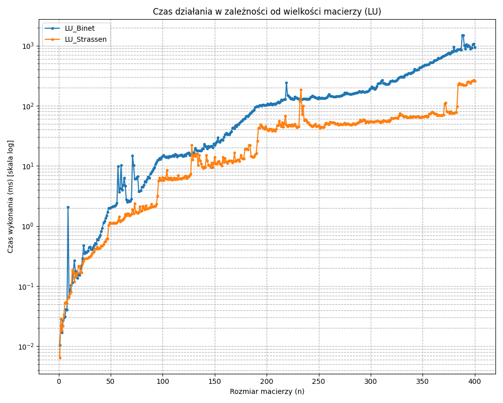

- Liczba operacji vs. rozmiar macierzy

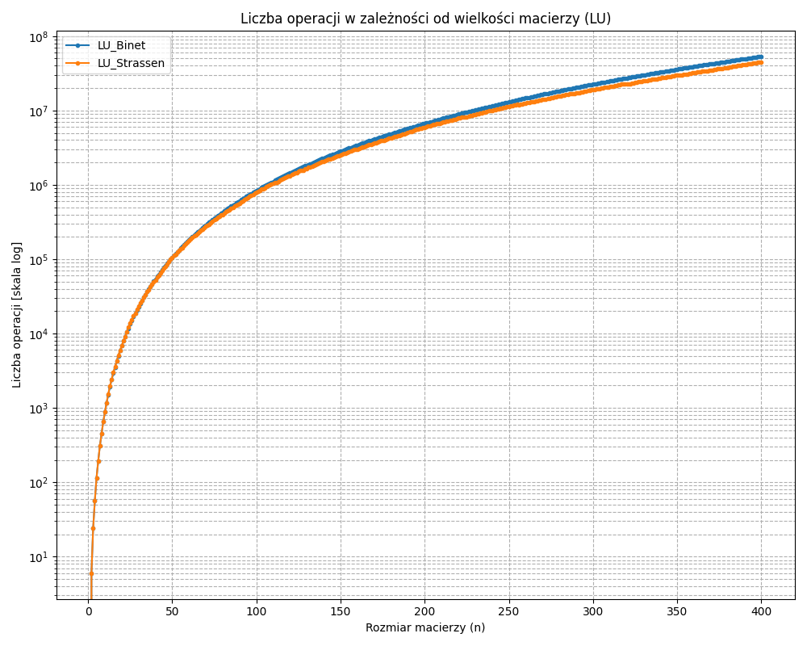

- Zużycie pamięci (KB) vs. rozmiar macierzy

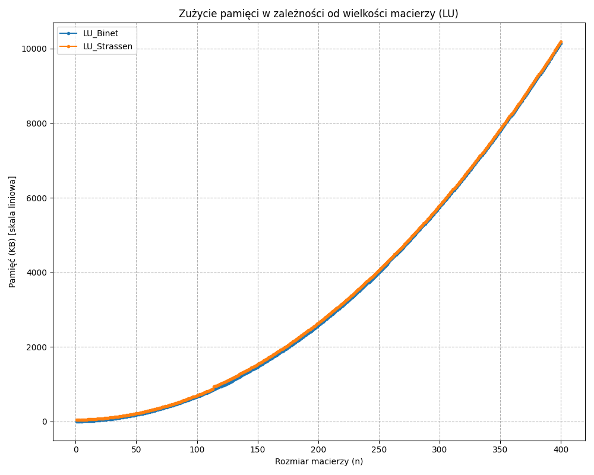

- Liczba operacji/czas działania (ms) vs. rozmiar macierzy

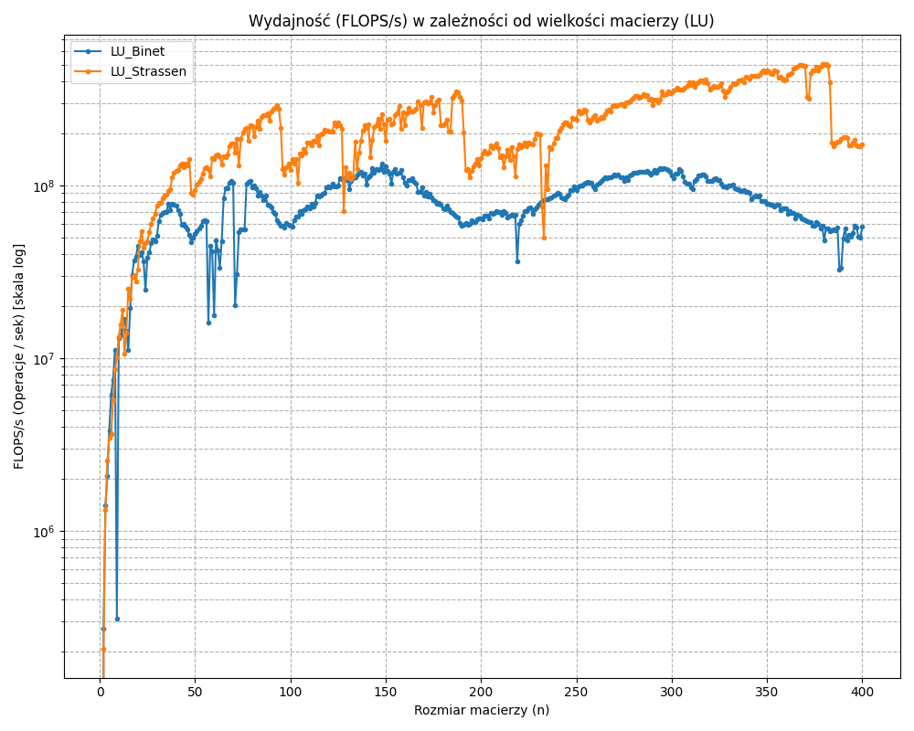

### Eliminacja Gaussa

- Czas działania (ms) vs. rozmiar macierzy

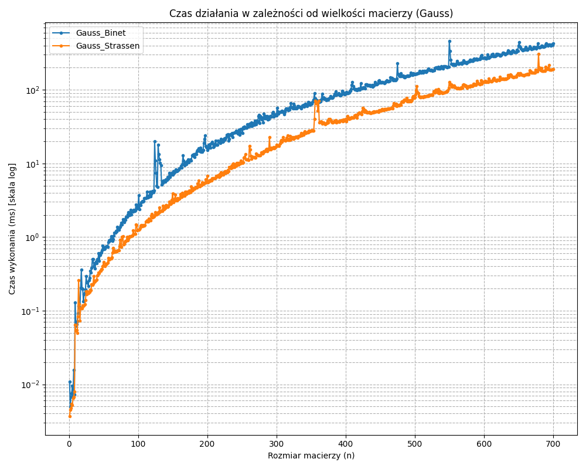

- Liczba operacji vs. rozmiar macierzy

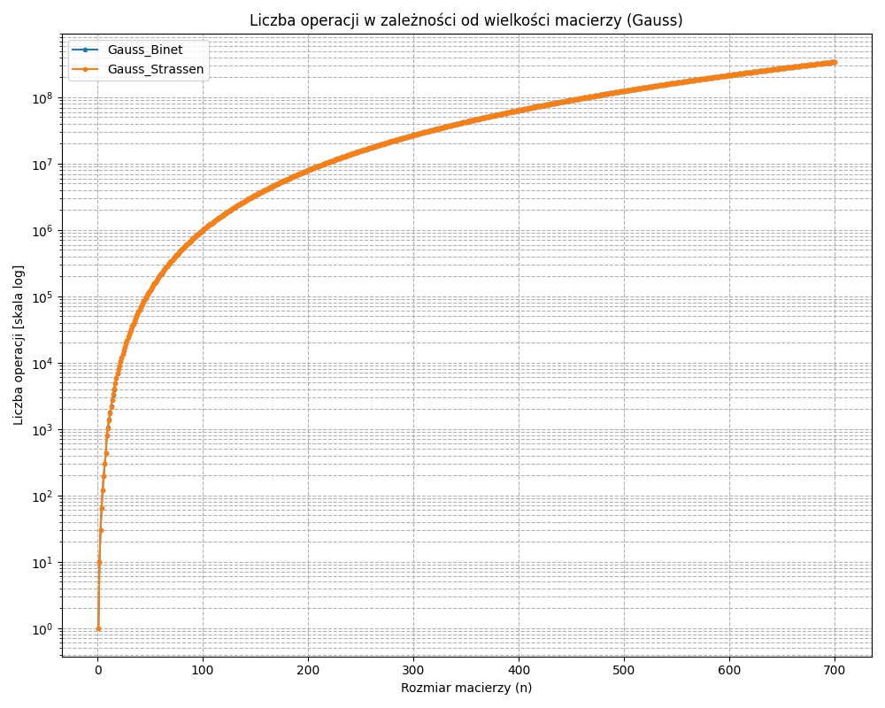

- Zużycie pamięci (KB) vs. rozmiar macierzy

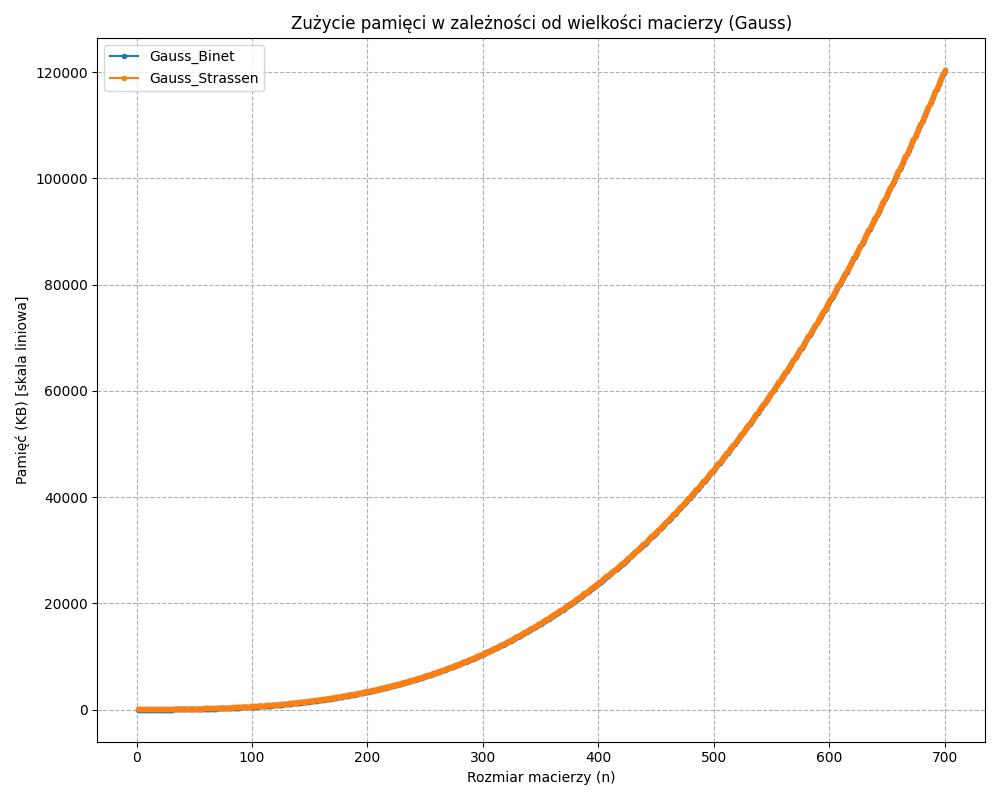

- Liczba operacji/czas działania (ms) vs. rozmiar macierzy
  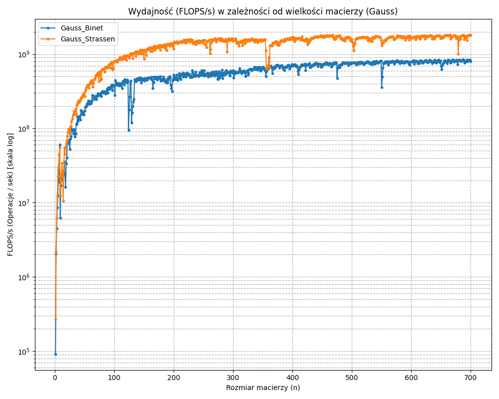

### Odwracanie macierzy

- Czas działania (ms) vs. rozmiar macierzy

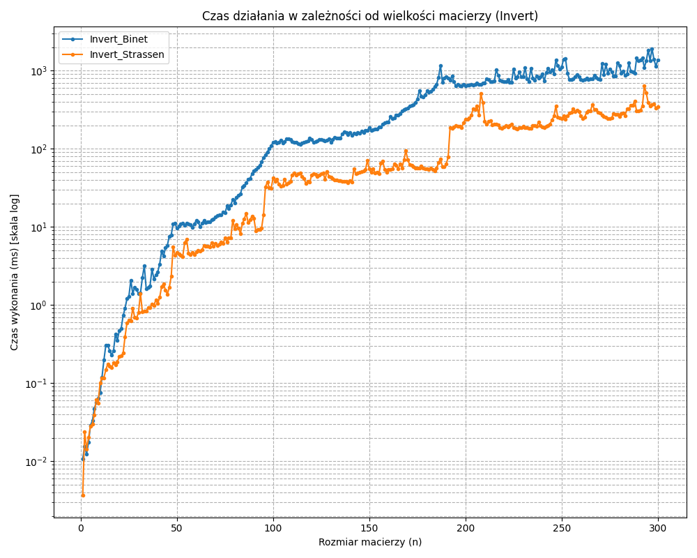

- Liczba operacji vs. rozmiar macierzy

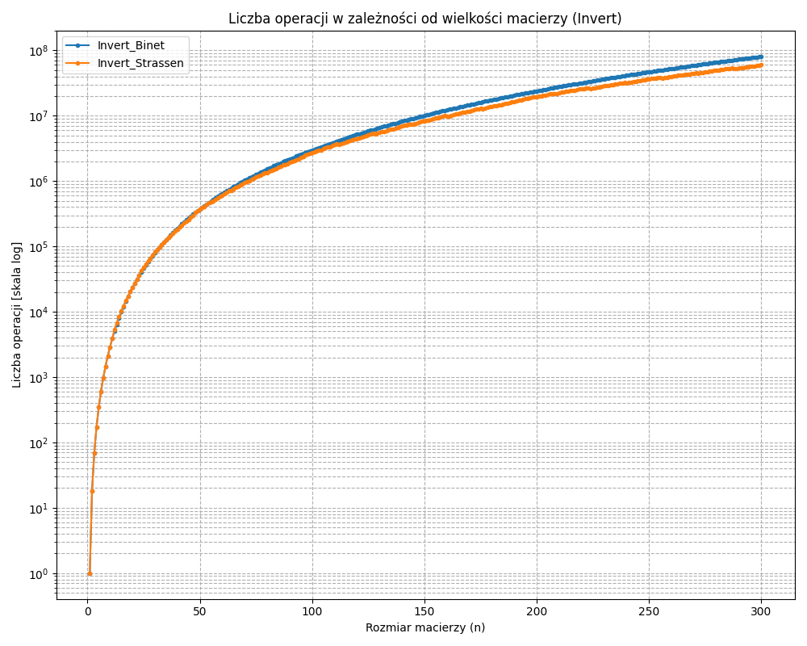

- Zużycie pamięci (KB) vs. rozmiar macierzy

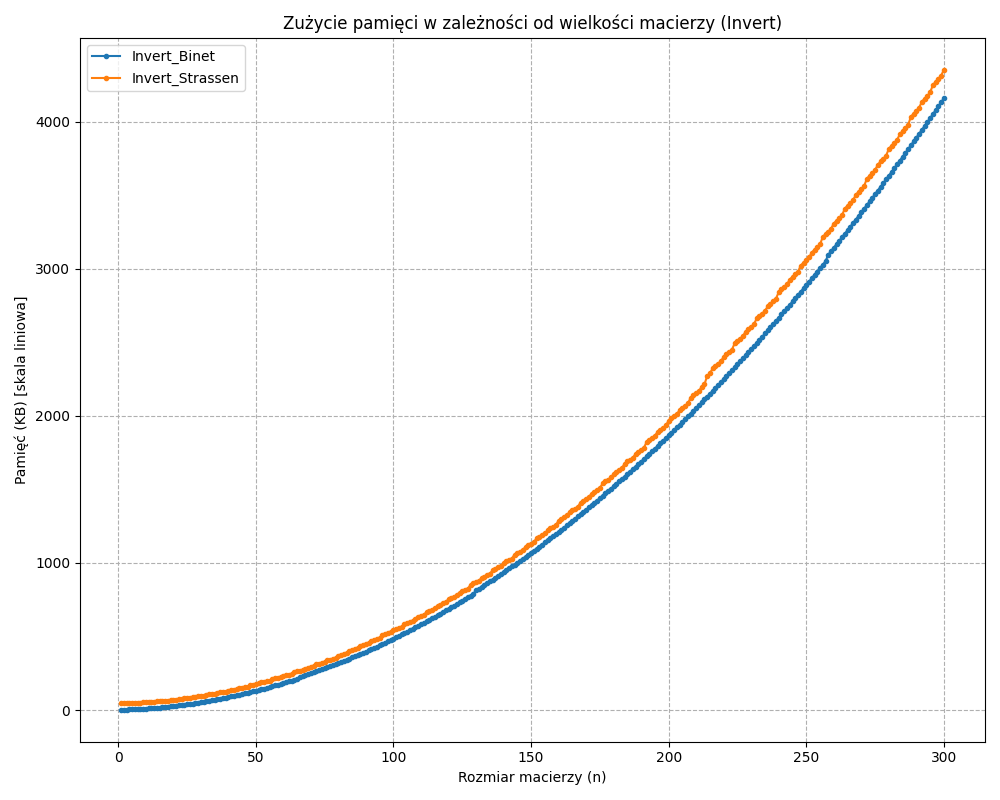

- Liczba operacji/czas działania (ms) vs. rozmiar macierzy

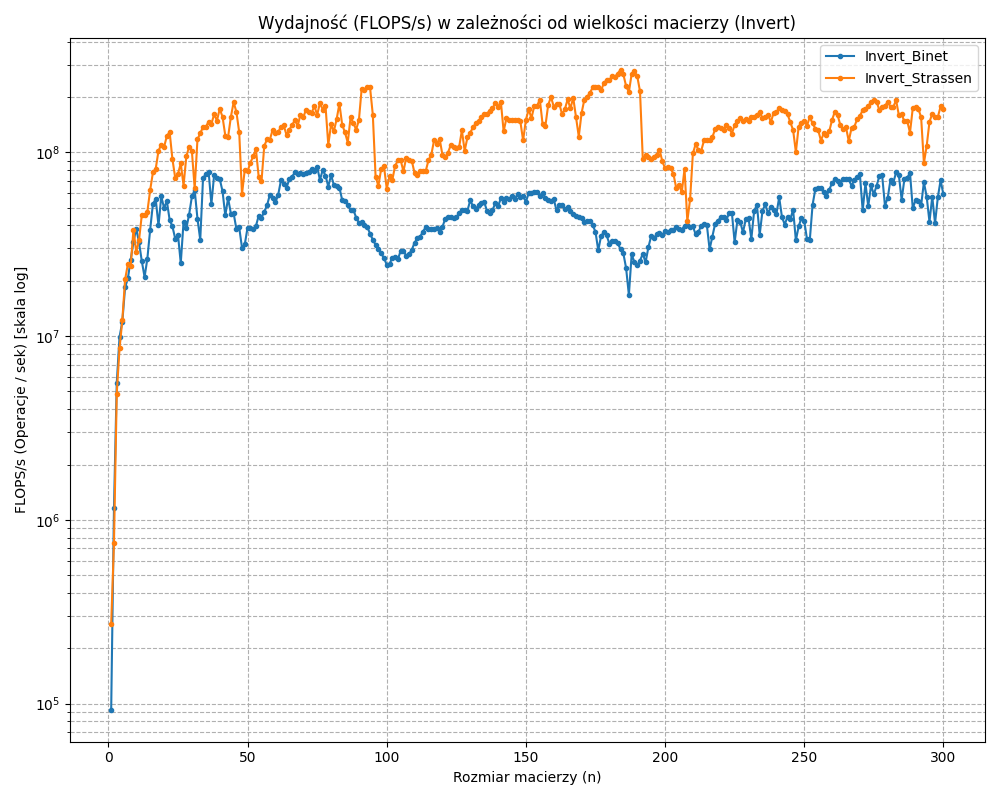

## Szacowanie złożoności obliczeniowej

- Binét: T(n) = 8·T(n/2) + O(n^2) => n^(log2 8) = n^3 dominuje => T(n) = O(n^3)
- Strassen: T(n) = 7·T(n/2) + O(n^2) => n^(log2 7) ≈ n^2.807 => T(n) = O(n^log2 7)

## Instrukcja uruchomienia (Windows, PowerShell)

Kompilacja (MSYS2/MinGW, C++17):

```powershell
g++ -std=c++17 -O2 -Wall -Wextra `
    -I lab1\src -I lab2\src `
    lab2\src\Lab2Benchmark.cpp `
    lab2\src\HelperFunctionsLab2.cpp `
    lab2\src\RecursiveGaussElimination.cpp `
    lab2\src\RecursiveLUFactorization.cpp `
    lab2\src\RecursivelyInversingMatrix.cpp `
    lab1\src\helperFunctions.cpp `
    lab1\src\matrix_Strassen.cpp `
    lab1\src\matrix_Binet.cpp `
    -lpsapi -o lab2\lab2_bench.exe
```

Uruchamianie benchmarków (przykładowo dla maksymalnego rozmiaru 700):

```powershell
.\n+lab2\lab2_bench.exe gauss 700
lab2\lab2_bench.exe lu 700
lab2\lab2_bench.exe invert 700
lab2\lab2_bench.exe all 700
```

## Uwagi końcowe

Podczas testów zaimplementowanych algorytmów (`RecursiveGaussElimination`, `RecursiveLUFactorization` oraz `RecursivelyInversingMatrix`) zaobserwowano, że algorytmy LU i Invert działają poprawnie tylko dla bardzo małych macierzy (np. N <= 3), natomiast algorytm Gauss zawodzi, gdy rozmiar problemu przekracza zdefiniowany `BLOCK_SIZE`.

Wszystkie te błędy mają wspólną przyczynę: brak stabilności numerycznej w algorytmach rekurencyjnych opartych na podziale blokowym.

1. Przyczyna niestabilności

   Zaimplementowane algorytmy `RecursiveLUFactorization` i `RecursivelyInversingMatrix` opierają się na "podręcznikowym" podziale rekurencyjnym `n/2`. Zakładają one, że lewy górny blok A11​ (oraz, w kolejnych krokach, dopełnienie Schura S) jest stabilnie odwracalny.

   W przypadku losowych macierzy założenie to jest niemal zawsze fałszywe. Algorytm w pewnym momencie trafia na pod-problem, w którym musi dzielić przez wartość bliską zeru. Prowadzi to do gwałtownej utraty precyzji i całkowicie błędnego wyniku.

   Algorytm `solve_block_gauss` zawodził z tego samego powodu – do rozwiązania pod-problemu A11​ używał niestabilnej funkcji `recursive_lu_factorization`. Dopóki rozmiar macierzy był mniejszy niż `BLOCK_SIZE`, używany był stabilny algorytm bazowy (`solve_pointwise_internal`, który posiada pivoting), co tłumaczy, dlaczego testy przechodziły dla małych N.

2. Trudność implementacji stabilnych algorytmów

   Naprawienie tego problemu wymagałoby implementacji częściowego wyboru elementu głównego (pivoting).

   W standardowym, iteracyjnym algorytmie jest to proste – polega na znalezieniu maksimum w jednej kolumnie i zamianie dwóch wierszy.

   W algorytmie blokowym-rekurencyjnym jest to zadanie nietrywialne. Stabilna implementacja wymagałaby:

   - Implementacji rozkładu LUP (PA=LU): Należałoby śledzić macierz permutacji P przez wszystkie kroki rekurencji.

   - Pivoting między blokami: Pivot (element o maksymalnej wartości) dla bloku A11​ może znajdować się fizycznie w bloku A21​.

   - Zarządzanie permutacjami: Wymusza to skomplikowane operacje zamiany wierszy, które muszą być zastosowane do wszystkich bloków (A12​, A22​) przed kontynuowaniem obliczeń, co znacząco komplikuje logikę algorytmów.

Z tego powodu, w praktycznych zastosowaniach obliczeniowych, do faktoryzacji LU często preferuje się wysoce zoptymalizowane algorytmy iteracyjne (jak te w bibliotekach BLAS/LAPACK), które implementują stabilny pivoting LUP.
