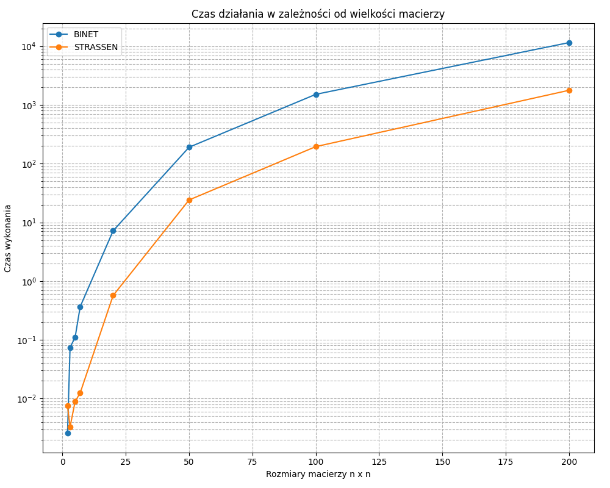
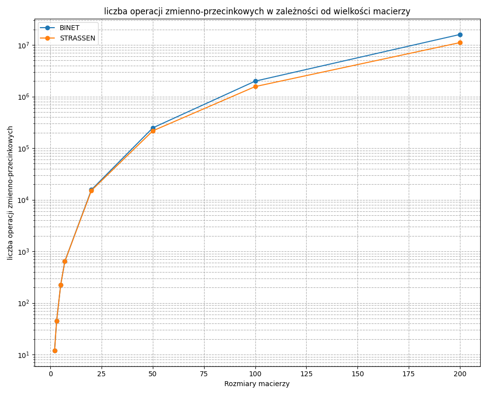
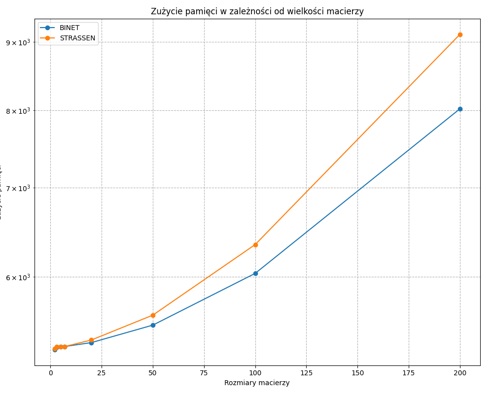

# Sprawozdanie — Lab 1: Rekurencyjne mnożenie macierzy (Binét, Strassen, AI)

Autorzy: Marek Swakoń, Szymon Tyburczy

## Cel i zakres

W ramach pierwszego zestawu zadań zaimplementowano i przeanalizowano trzy algorytmy mnożenia macierzy z losowymi wartościami z przedziału otwartego (0.00000001, 1.0):

- Rekurencyjne mnożenie macierzy metodą Binét’a
- Rekurencyjne mnożenie macierzy metodą Strassena
- Mnożenie macierzy metodą AI (na podstawie artykułu w Nature)

W trakcie eksperymentów zliczano liczbę operacji zmiennoprzecinkowych (dodawanie, odejmowanie, mnożenie, dzielenie) wykonywanych podczas mnożenia.

## Generowanie danych wejściowych

- Generator macierzy: wartości losowe z przedziału (0.00000001, 1.0), rozkład jednostajny.
- Rozmiary testowe: 1, 2, 3, …, 1000 (do maksymalnego N, który dało się policzyć na stanowisku).
- Warunki brzegowe: małe N (walidacja poprawności), duże N (pomiar wydajności i zużycia pamięci).

## Pseudokod (wysoki poziom)

### 1) Binét — rekurencyjne mnożenie

1. Wejście: Macierze A ∈ R^{m×k}, B ∈ R^{k×p}
2. Jeśli m ≤ 2 lub k ≤ 2 lub p ≤ 2: wykonaj naiwne (iteracyjne) mnożenie i zliczając operacje
3. Podziel A na 4 podmacierze: a11, a12, a21, a22
4. Podziel B na 4 podmacierze: b11, b12, b21, b22
5. Oblicz rekurencyjnie 8 iloczynów częściowych:
   - M1 = a11 \* b11
   - M2 = a12 \* b21
   - M3 = a11 \* b12
   - M4 = a12 \* b22
   - M5 = a21 \* b11
   - M6 = a22 \* b21
   - M7 = a21 \* b12
   - M8 = a22 \* b22
6. Złóż macierz C z sum częściowych:
   - c11 = M1 + M2
   - c12 = M3 + M4
   - c21 = M5 + M6
   - c22 = M7 + M8
7. Zwróć C

### 2) Strassen — rekurencyjne mnożenie

1. Wejście: A, B ∈ R^{N×N}
2. Dla N = 1: zwróć [A[0,0]·B[0,0]]
3. Dla N parzystego:
   - Podziel A i B na 4 podmacierze każda
   - Wyznacz pomocnicze sumy i różnice potrzebne do obliczenia M1…M7
   - Wyznacz 7 iloczynów pośrednich (M1…M7) zgodnie z klasycznym schematem Strassena
   - Złóż C z kombinacji M1…M7
4. Dla N nieparzystego:
   - Podziel A i B na 4 niesymetryczne bloki: główny (N-1)×(N-1), kolumnę (N-1)×1, wiersz 1×(N-1) i skalar 1×1
   - Wyznacz 4 bloki wynikowe (C11, C12, C21, C22) zgodnie ze standardową formułą mnożenia blokowego
   - Wyznacz iloczyn główny (A11B11) przez rekurencyjne wywołanie Strassena; pozostałe 7 iloczynów oblicz metodą iteracyjną
   - Złóż C z obliczonych bloków C11, C12, C21, C22
5. Zwróć C

### 3) Metoda AI (wg Nature)

##### Funkcja bazowa:

1. Wejście: macierz A [4×5], macierz B [5×5]:
2. Oblicz 76 wartości H, zgodnie z opisem metody z artykułu
3. Utwórz macierz C [4×5]
4. Wypełnij C kombinacjami wartości H, zgodnie z opisem metody z artykułu
5. Zwróć C

---

##### Funkcja rekurencyjna:

1. Sprawdź warunek bazowy: JEŻELI (M=4, K=5, P=5), ZWRÓĆ matrix_ai(A, B)
2. Sprawdź parzystość: JEŻELI (M, K lub P jest nieparzyste), ZGŁOŚ BŁĄD
3. Podziel A na 4 bloki: A11, A12, A21, A22
4. Podziel B na 4 bloki: B11, B12, B21, B22
5. Oblicz 8 iloczynów pośrednich przez rekurencyjne wywołania
6. Oblicz 4 bloki wynikowe przez sumowanie par (np. C11 = P1 + P2, C12 = P3 + P4, ...)
7. Złóż C [M×P] z bloków C11, C12, C21, C22
8. Zwróć C

## Najważniejsze fragmenty kodu

- Implementacja rekurencyjna Binét
- Implementacja Strassena (z obsługą brzegów lub informacją o ograniczeniach)
- Implementacja AI (oraz licznik operacji)

### Funkcje pomocnicze

- Funkcja generująca macierz o zadanych wymiarach z wartościami między 0.00000001 a 1.0

```cpp
Matrix createMatrix(int rows, int cols, bool random) {
    Matrix mat(rows, std::vector<double>(cols, 0.0));
    if (random && rows > 0 && cols > 0) {
        unsigned seed = std::chrono::system_clock::now().time_since_epoch().count();
        std::mt19937 gen(seed);
        std::uniform_real_distribution<double> dis(0.00000001, 1.0);

        for (int i = 0; i < rows; ++i) {
            for (int j = 0; j < cols; ++j) {
                mat[i][j] = dis(gen);
            }
        }
    }
    return mat;
}
```

- Funkcja zwracająca podmacierz

```cpp
// wklej tu poprawioną funkcję subMatrix
```

- Funkcja dodająca dwie macierze i zliczająca operacje

```cpp
// wklej tu poprawioną funkcję addMatrices
```

- Funkcja odejmująca dwie macierze i zliczająca operacje

```cpp
// wklej tu poprawioną funkcję subtractMatrices
```

- Funkcja łącząca cztery podmacierze w jedną macierz

```cpp
// wklej tu poprawioną funkcję joinMatrices
```

- Funkcja mnożenia iteracyjnego (nawiasowe) z licznikiem operacji

```cpp
Matrix iterativeMultiply(const Matrix &A, const Matrix &B, unsigned long long &op_count)
{
    int m = A.size();
    int k = (m > 0) ? A[0].size() : 0;
    int p = (B.size() > 0) ? B[0].size() : 0;

    if (k != (int)B.size())
    {
        throw std::invalid_argument("Incompatible matrix dimensions for multiplication.");
    }

    Matrix C = createMatrix(m, p);
    for (int i = 0; i < m; ++i)
    {
        for (int j = 0; j < p; ++j)
        {
            double sum = 0.0;
            for (int l = 0; l < k; ++l)
            {
                sum += A[i][l] * B[l][j];
                op_count++;
            }
            C[i][j] = sum;
            if (k > 1)
            {
                op_count += (k - 1);
            }
        }
    }
    return C;
}
```

### Implementacja rekurencyjna Binét

```cpp
Matrix recursiveMultiply(const Matrix& A, const Matrix& B, unsigned long long& op_count) {
    int m = A.size();
    int k = (m > 0) ? A[0].size() : 0;
    int p = (B.size() > 0) ? B[0].size() : 0;

    if (m == 0 || k == 0 || p == 0) {
        return createMatrix(m, p);
    }

    if (m <= 2 || k <= 2 || p <= 2) {
        Matrix C_iter = createMatrix(m, p);
        for (int i = 0; i < m; ++i) {
            for (int j = 0; j < p; ++j) {
                double sum = 0.0;
                for (int l = 0; l < k; ++l) {
                    sum += A[i][l] * B[l][j];
                    op_count++;
                }
                C_iter[i][j] = sum;
                if (k > 1) {
                    op_count += (k - 1);
                }
            }
        }
        return C_iter;
    }

    int m_split = m / 2;
    int k_split = k / 2;
    int p_split = p / 2;

    Matrix a11 = subMatrix(A, 0, m_split, 0, k_split);
    Matrix a12 = subMatrix(A, 0, m_split, k_split, k);
    Matrix a21 = subMatrix(A, m_split, m, 0, k_split);
    Matrix a22 = subMatrix(A, m_split, m, k_split, k);

    Matrix b11 = subMatrix(B, 0, k_split, 0, p_split);
    Matrix b12 = subMatrix(B, 0, k_split, p_split, p);
    Matrix b21 = subMatrix(B, k_split, k, 0, p_split);
    Matrix b22 = subMatrix(B, k_split, k, p_split, p);

    Matrix c11_p1 = recursiveMultiply(a11, b11, op_count);
    Matrix c11_p2 = recursiveMultiply(a12, b21, op_count);

    Matrix c12_p1 = recursiveMultiply(a11, b12, op_count);
    Matrix c12_p2 = recursiveMultiply(a12, b22, op_count);

    Matrix c21_p1 = recursiveMultiply(a21, b11, op_count);
    Matrix c21_p2 = recursiveMultiply(a22, b21, op_count);

    Matrix c22_p1 = recursiveMultiply(a21, b12, op_count);
    Matrix c22_p2 = recursiveMultiply(a22, b22, op_count);

    Matrix c11 = addMatrices(c11_p1, c11_p2, op_count);
    Matrix c12 = addMatrices(c12_p1, c12_p2, op_count);
    Matrix c21 = addMatrices(c21_p1, c21_p2, op_count);
    Matrix c22 = addMatrices(c22_p1, c22_p2, op_count);

    Matrix C = createMatrix(m, p);
    joinMatrices(C, c11, c12, c21, c22, m_split, p_split);

    return C;
}
```

## Metodologia pomiarowa

- Czas: std::chrono::high_resolution_clock (średnia z ≥3 powtórzeń na punkt)
- Operacje: ręcznie inkrementowany licznik przy każdej operacji +, −, ·, /
- Pamięć: WinAPI (GetProcessMemoryInfo / PSAPI) lub odpowiednik; raport w KB
- Walidacja: porównanie wyników z wersją iteracyjną O(N^3) przy tolerancji ϵ = 1e−9

Format wyników (CSV):

```
Size,Algorithm,Operations,Duration_ms,Memory_kb
16,Strassen,XXXX,YY.Y,ZZZZ
...
```

Pliki CSV w repozytorium:

- `matrix_multiplication_results_BINET.csv`
- `matrix_multiplication_results_STRASSEN.csv`
- `matrix_multiplication_results_AlphaTensor.csv` lub `ai_recursive_benchmark.csv`

---

## Wyniki i wykresy

Wstaw wykresy (lub podlinkuj pliki PNG) dla zakresu N = 1…N_max:

1. Czas działania (ms) vs. rozmiar macierzy (oś X)



2. Liczba operacji zmiennoprzecinkowych vs. rozmiar



3. Zużycie pamięci (KB) vs. rozmiar



Tabela przykładowa (fragment):

| N   | Algorytm | Operacje [#] | Czas [ms] | Pamięć [KB] |
| --- | -------- | ------------ | --------- | ----------- |
| 16  | Binét    | …            | …         | …           |
| 16  | Strassen | …            | …         | …           |
| 16  | AI       | …            | …         | …           |

---

## Ograniczenia, błędy i obsługa przypadków brzegowych

- Brak paddingu: jeżeli algorytm wymaga specyficznych wymiarów (np. parzyste N), program powinien zakończyć pracę i wypisać czytelny komunikat (bez sztucznego dopełniania).
- Stabilność numeryczna: porównania wyników z tolerancją ϵ.
- Zużycie pamięci: opis ewentualnych pików pamięci i ich przyczyn.

---

## Szacowanie złożoności obliczeniowej

- Binét: … (wyprowadzenie/odwołanie do literatury) — eksperymentalne dopasowanie krzywej
- Strassen: O(N^{log₂7}) ≈ O(N^{2.807}); pomiar vs. teoria
- AI: opis przewidywanej złożoności i obserwacje eksperymentalne

Metoda estymacji: regresja log–log (czas/operacje vs. N), wykres trendu i współczynnik R².

---

## Walidacja poprawności

- Testy małych rozmiarów (N=2,3,5,7,…) — porównanie z implementacją iteracyjną
- Dodatkowo testy losowe dla kilku N, weryfikacja normy błędu ||C_ref − C||\_F

---

## Instrukcja uruchomienia (Windows, PowerShell)

Kompilacja (MSYS2/MinGW, C++17):

```powershell
g++ -std=c++17 -O2 -Wall -Wextra -DNOMINMAX -o matrix_Binet.exe matrix_Binet.cpp -lpsapi
g++ -std=c++17 -O2 -Wall -Wextra -DNOMINMAX -o matrix_Strassen.exe matrix_Strassen.cpp -lpsapi
g++ -std=c++17 -O2 -Wall -Wextra -DNOMINMAX -o matrix_ai.exe matrix_ai.cpp -lpsapi
```

Uruchomienie:

```powershell
./matrix_Binet.exe
./matrix_Strassen.exe
./matrix_ai.exe
```

Skrypt z wykresami (opcjonalnie):

```powershell
py ./Binet_Strassen.py
```

---

## Dyskusja i wnioski

- Porównanie osiągów (czas, operacje, pamięć) między Binét / Strassen / AI
- Kiedy który algorytm jest korzystny i dlaczego
- Wpływ ograniczeń (brak paddingu) na implementację i wyniki
- Potencjalne kierunki optymalizacji

---

## Bibliografia

1. Volker Strassen, Gaussian Elimination is Not Optimal, 1969
2. Artykuł „Nature” dot. mnożenia macierzy metodą AI — pełny cytat
3. Inne źródła (podręczniki, wykłady, wpisy blogowe) — pełne odniesienia

---

Checklist (do odhaczenia przed oddaniem):

- [ ] Pseudokod obu algorytmów rekurencyjnych
- [ ] Fragmenty kodu (najważniejsze miejsca)
- [ ] Wykresy: czas, operacje, pamięć (1…N_max)
- [ ] CSV z wynikami dołączone do repo
- [ ] Oszacowanie złożoności (teoria/eksperyment)
- [ ] Walidacja poprawności na małych N
- [ ] Opis ograniczeń i braku paddingu
